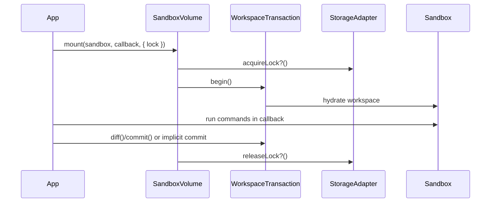

# Phase 4: Locking + Mount API

> **GitHub Issue:** TBD · **Epic:** [AGENTS.md](./AGENTS.md)
> **Dependencies:** Phase 2, Phase 3
> **Parallel with:** None
> **Blocks:** Phase 5

## Objective

Turn the lower-level transaction flow into the user-facing API promised by the README: `SandboxVolume.create()`, `begin()`, and `mount()`, with explicit locking semantics and reliable cleanup.

## What You're Building



## Deliverables

1. `packages/sandbox-volume/src/sandbox-volume.ts`

Implement:

- `SandboxVolume.create(options)`
- `begin(sandbox, options?)`
- `mount(sandbox, callback, options?)`

2. `packages/sandbox-volume/src/transaction.ts`

Finalize lifecycle behavior:

- explicit `close()`
- implicit commit rules for `mount()`
- adapter lock acquire / release hooks
- cleanup on callback failure

3. `packages/sandbox-volume/src/__tests__/mount.test.ts`

Cover:

- successful callback with implicit commit
- callback failure with cleanup
- lock hook invocation ordering

## Verification

1. **Automated checks**

```bash
pnpm --filter @giselles-ai/sandbox-volume test
pnpm --filter @giselles-ai/sandbox-volume build
```

2. **Manual test scenarios**

1. `mount()` success path → callback edits a file → returned diff matches commit result
2. `mount()` throws → transaction closes and lock releases → no leaked state remains in memory adapter

## Files to Create/Modify

| File | Action |
|---|---|
| `packages/sandbox-volume/src/sandbox-volume.ts` | **Create** |
| `packages/sandbox-volume/src/transaction.ts` | **Modify** |
| `packages/sandbox-volume/src/__tests__/mount.test.ts` | **Create** |
| `packages/sandbox-volume/src/index.ts` | **Modify** |

## Done Criteria

- [ ] High-level API maps cleanly to the README contract
- [ ] Locking is explicit and optional, not implicit magic
- [ ] Transaction cleanup is reliable on both success and failure
- [ ] Update the status in [AGENTS.md](./AGENTS.md) to `✅ DONE`
