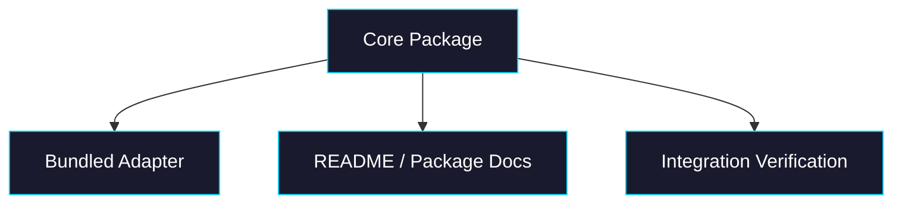

# Phase 5: Adapters + Docs + Verification

> **GitHub Issue:** TBD · **Epic:** [AGENTS.md](./AGENTS.md)
> **Dependencies:** Phase 4
> **Parallel with:** None
> **Blocks:** None

## Objective

Ship a coherent first release candidate for the package: at least one bundled adapter, aligned docs, and end-to-end verification that proves the package does what the README claims.

## What You're Building



## Deliverables

1. `packages/sandbox-volume/src/adapters/memory.ts` and optional real adapter entrypoint

Add:

- memory adapter for tests/examples
- optionally first real backend adapter if credentials and package shape are ready

2. `packages/sandbox-volume/README.md`

Rewrite the README against what actually exists:

- fixed API signatures
- explicit statement that this is transactional sync, not a real mount
- accurate examples for `runCommand`, adapter setup, and commit semantics
- mark future items such as `fork()` / `share()` as planned only

3. `packages/sandbox-volume/src/__tests__/integration.test.ts`

Add one end-to-end flow:

- hydrate existing files
- mutate through sandbox abstraction
- diff and commit
- reload and verify persistence

## Verification

1. **Automated checks**

```bash
pnpm --filter @giselles-ai/sandbox-volume test
pnpm --filter @giselles-ai/sandbox-volume build
pnpm --filter @giselles-ai/sandbox-volume typecheck
```

2. **Manual test scenarios**

1. First run with empty backend → commit files → second run reloads those files
2. Delete a file in run 2 → third run confirms the file stays deleted

## Files to Create/Modify

| File | Action |
|---|---|
| `packages/sandbox-volume/src/adapters/memory.ts` | **Create** |
| `packages/sandbox-volume/README.md` | **Modify** |
| `packages/sandbox-volume/src/__tests__/integration.test.ts` | **Create** |
| `packages/sandbox-volume/src/index.ts` | **Modify** |
| `packages/sandbox-volume/package.json` | **Modify** if adapter exports are added |

## Done Criteria

- [ ] README matches shipped behavior rather than future intent
- [ ] Package has at least one concrete adapter path for tests/examples
- [ ] End-to-end tests prove persistence across multiple transactions
- [ ] Update the status in [AGENTS.md](./AGENTS.md) to `✅ DONE`
