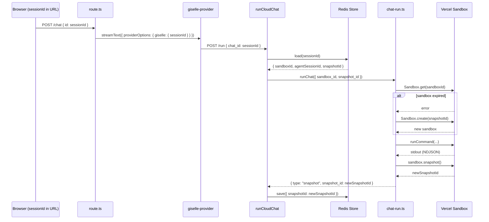
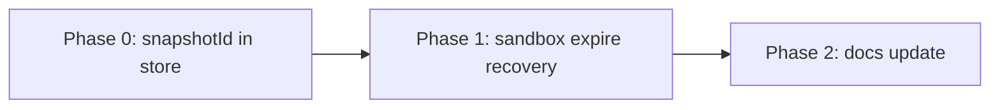

# Epic: Session Resume — Store-Driven Sandbox Recovery

## Goal

After this epic is complete, conversations can be resumed across page reloads by passing only a `sessionId`. The `CloudChatStateStore` (Redis) is the single source of truth for sandbox and snapshot state — applications do not need their own database for these values. When a sandbox has expired, the system automatically recreates it from the last known snapshot.

## Why

- The store already persists `sandboxId` and `agentSessionId` keyed by `chatId`, and `runCloudChat` already restores them on subsequent requests.
- However, `snapshotId` is **not** persisted in the store. If a sandbox expires (Vercel Sandbox TTL), there is no way to recover — `Sandbox.get()` throws and the conversation is lost.
- Currently, `chat-run.ts` treats `Sandbox.get()` failure as a fatal error with no fallback.
- By persisting `snapshotId` and adding sandbox-expire recovery, apps only need to remember `sessionId` (e.g., in the URL) — the store handles everything else.

Benefits:
- Apps don't need a database for sandbox/snapshot/session state
- Sandbox expiration becomes a transparent recovery instead of a fatal error
- Cleaner separation: store owns infrastructure state, app owns UX state

## Architecture Overview



## Package / Directory Structure

```
packages/agent/src/
├── cloud-chat-state.ts          ← MODIFY: add snapshotId to state/patch types, reduceCloudChatEvent, applyCloudChatPatch
├── cloud-chat-state.test.ts     ← MODIFY: add snapshot event tests, applyCloudChatPatch with snapshotId
├── chat-run.ts                  ← MODIFY: add Sandbox.get() fallback to Sandbox.create(snapshotId)
├── cloud-chat.ts                ← MODIFY: pass snapshotId from store to runtimeInput
└── cloud-chat-store.test.ts     ← EXISTING (no changes needed — serialization is JSON.stringify)

docs/03-architecture/
└── 03-01-architecture.md        ← MODIFY: update "Layer 4: Session State" table and state flow description
```

## Task Dependency Graph



All phases are sequential — Phase 1 depends on Phase 0, Phase 2 depends on Phase 1.

## Task Status

| Phase | Task File | Status | Description |
|---|---|---|---|
| 0 | [phase-0-snapshot-in-store.md](./phase-0-snapshot-in-store.md) | ✅ DONE | Add `snapshotId` to `CloudChatSessionState` and persist it from NDJSON events |
| 1 | [phase-1-sandbox-expire-recovery.md](./phase-1-sandbox-expire-recovery.md) | ✅ DONE | Fallback to `Sandbox.create(snapshotId)` when `Sandbox.get()` fails |
| 2 | [phase-2-docs-update.md](./phase-2-docs-update.md) | ✅ DONE | Update architecture docs to reflect snapshotId in store and recovery flow |

> **How to work on this epic:** Read this file first to understand the full architecture.
> Then check the status table above. Pick the first `🔲 TODO` task whose dependencies
> (see dependency graph) are `✅ DONE`. Open that task file and follow its instructions.
> When done, update the status in this table to `✅ DONE`.

## Key Conventions

- Monorepo: pnpm workspaces + Turborepo
- Test runner: Vitest (`pnpm --filter @giselles-ai/agent test`)
- Formatter: Biome
- TypeScript strict mode
- All state types in `cloud-chat-state.ts`, store implementation in `cloud-chat-store.ts`
- NDJSON event → patch mapping via `reduceCloudChatEvent()`
- Patch application via `applyCloudChatPatch()`

## Existing Code Reference

| File | Relevance |
|---|---|
| `packages/agent/src/cloud-chat-state.ts` | State types, `reduceCloudChatEvent`, `applyCloudChatPatch` — primary modification target |
| `packages/agent/src/cloud-chat-state.test.ts` | Existing tests for reduce/apply — add snapshot tests here |
| `packages/agent/src/chat-run.ts` L110-133 | `Sandbox.get()` / `Sandbox.create()` logic — add expire fallback here |
| `packages/agent/src/cloud-chat.ts` L237-245 | `runtimeInput` assembly — needs to pass `snapshotId` from store |
| `packages/agent/src/cloud-chat.ts` L372-382 | `resumeCloudChat` `runtimeInput` — same change needed |
| `packages/agent/src/cloud-chat-store.ts` | Redis store — no code changes, just awareness of JSON serialization |
| `docs/03-architecture/03-01-architecture.md` L216-231 | Session State table and description |

## NDJSON Event Reference

| Event | Example | Store Field |
|---|---|---|
| `{ type: "init", session_id: "..." }` | Agent session started | `agentSessionId` |
| `{ type: "sandbox", sandbox_id: "..." }` | Sandbox created/resumed | `sandboxId` |
| `{ type: "snapshot", snapshot_id: "..." }` | Post-run snapshot captured | `snapshotId` ← **NEW** |
| `{ type: "relay.session", ... }` | Relay session created | `relay` |
| `{ type: "snapshot_request", ... }` | Browser tool request | `pendingTool` |
