# Phase 0: Persist snapshotId in CloudChatStateStore

> **Epic:** [AGENTS.md](./AGENTS.md)
> **Dependencies:** None
> **Blocks:** Phase 1

## Objective

Add `snapshotId` to `CloudChatSessionState` and `CloudChatSessionPatch` so that when `chat-run.ts` emits `{ type: "snapshot", snapshot_id: "..." }`, the store persists it. Also update `runCloudChat` and `resumeCloudChat` to pass the stored `snapshotId` into the runtime input so `chat-run.ts` can use it as a fallback when the sandbox expires.

## What You're Building

```mermaid
flowchart LR
    Event["NDJSON: { type: snapshot }"] --> Reduce["reduceCloudChatEvent()"]
    Reduce --> Patch["{ snapshotId: '...' }"]
    Patch --> Apply["applyCloudChatPatch()"]
    Apply --> State["CloudChatSessionState.snapshotId"]
    State --> Store["Redis (JSON.stringify)"]

    Store --> Load["store.load(chatId)"]
    Load --> Runtime["runtimeInput.snapshot_id"]
```



## Deliverables

### 1. `packages/agent/src/cloud-chat-state.ts` — Add snapshotId to types and reducer

**Types — add `snapshotId` field:**

```typescript
export type CloudChatSessionState = {
  chatId: string;
  agentSessionId?: string;
  sandboxId?: string;
  snapshotId?: string;          // ← NEW
  relay?: CloudRelaySession;
  pendingTool?: PendingToolState | null;
  updatedAt: number;
};

export type CloudChatSessionPatch = {
  agentSessionId?: string;
  sandboxId?: string;
  snapshotId?: string;          // ← NEW
  relay?: CloudRelaySession;
  pendingTool?: PendingToolState | null;
};
```

**`reduceCloudChatEvent` — add snapshot event handling:**

Add a new branch after the `sandbox` handler:

```typescript
if (event.type === "snapshot" && typeof event.snapshot_id === "string") {
  return { snapshotId: event.snapshot_id };
}
```

**`applyCloudChatPatch` — merge snapshotId:**

Add to the return object:

```typescript
snapshotId: input.patch?.snapshotId ?? input.base?.snapshotId,
```

### 2. `packages/agent/src/cloud-chat.ts` — Pass snapshotId from store to runtimeInput

In `runCloudChat` (around L237-245), add `snapshot_id` from the existing state:

```typescript
const runtimeInput = {
  ...input.request,
  ...(existing?.agentSessionId
    ? { session_id: existing.agentSessionId }
    : {}),
  ...(existing?.sandboxId ? { sandbox_id: existing.sandboxId } : {}),
  ...(existing?.snapshotId ? { snapshot_id: existing.snapshotId } : {}),  // ← NEW
  relay_session_id: relaySession.sessionId,
  relay_token: relaySession.token,
} as TRequest;
```

In `resumeCloudChat` (around L372-382), same change:

```typescript
const runtimeInput = {
  ...input.request,
  ...(input.existing.agentSessionId
    ? { session_id: input.existing.agentSessionId }
    : {}),
  ...(input.existing.sandboxId
    ? { sandbox_id: input.existing.sandboxId }
    : {}),
  ...(input.existing.snapshotId
    ? { snapshot_id: input.existing.snapshotId }
    : {}),                                                                // ← NEW
  relay_session_id: relaySession.sessionId,
  relay_token: relaySession.token,
} as unknown as TRequest;
```

**Note:** The `snapshot_id` from the store acts as a fallback. If the incoming request already includes `snapshot_id` (via `input.request`), the spread order means the store value is overridden by the request value because `...input.request` comes first. This is the correct behavior — the request's `snapshot_id` is the initial build snapshot, while the store's `snapshot_id` is the latest runtime snapshot, and it should take precedence. Verify the spread order produces the intended result.

### 3. `packages/agent/src/cloud-chat-state.test.ts` — Add tests

Add these test cases:

```typescript
it("maps snapshot events to snapshotId patches", () => {
  const patch = reduceCloudChatEvent({
    type: "snapshot",
    snapshot_id: "snap_abc123",
  });
  expect(patch).toEqual({ snapshotId: "snap_abc123" });
});

it("ignores snapshot events without snapshot_id", () => {
  const patch = reduceCloudChatEvent({ type: "snapshot" });
  expect(patch).toBeNull();
});

it("preserves snapshotId when applying patches", () => {
  const state = applyCloudChatPatch({
    chatId: "chat-789",
    now: 1730000300,
    base: {
      chatId: "chat-789",
      sandboxId: "sandbox-1",
      snapshotId: "snap_old",
      updatedAt: 1720000000,
    },
    patch: {
      snapshotId: "snap_new",
    },
  });
  expect(state.snapshotId).toBe("snap_new");
  expect(state.sandboxId).toBe("sandbox-1");
});

it("carries forward snapshotId from base when patch does not include it", () => {
  const state = applyCloudChatPatch({
    chatId: "chat-790",
    now: 1730000400,
    base: {
      chatId: "chat-790",
      snapshotId: "snap_existing",
      updatedAt: 1720000000,
    },
    patch: {
      sandboxId: "sandbox-new",
    },
  });
  expect(state.snapshotId).toBe("snap_existing");
  expect(state.sandboxId).toBe("sandbox-new");
});
```

## Verification

1. `pnpm --filter @giselles-ai/agent test` — all tests pass
2. `npx tsc --noEmit` in `packages/agent` — no type errors
3. Manually verify that existing `applyCloudChatPatch` tests still pass with the new `snapshotId: undefined` in their expected output (if they use `toEqual`, they may need updating)

## Files to Create/Modify

| File | Action |
|---|---|
| `packages/agent/src/cloud-chat-state.ts` | **Modify** — add `snapshotId` to types, reducer, and patch applier |
| `packages/agent/src/cloud-chat-state.test.ts` | **Modify** — add snapshot event and patch tests |
| `packages/agent/src/cloud-chat.ts` | **Modify** — pass `snapshotId` from store to runtimeInput in both `runCloudChat` and `resumeCloudChat` |

## Done Criteria

- [ ] `CloudChatSessionState` and `CloudChatSessionPatch` include `snapshotId?: string`
- [ ] `reduceCloudChatEvent` returns `{ snapshotId }` for `{ type: "snapshot" }` events
- [ ] `applyCloudChatPatch` merges `snapshotId` like other fields
- [ ] `runCloudChat` and `resumeCloudChat` pass stored `snapshotId` as `snapshot_id` in runtimeInput
- [ ] All new tests pass
- [ ] Existing tests still pass (update `toEqual` expectations if needed)
- [ ] Update the status in [AGENTS.md](./AGENTS.md) to `✅ DONE`
