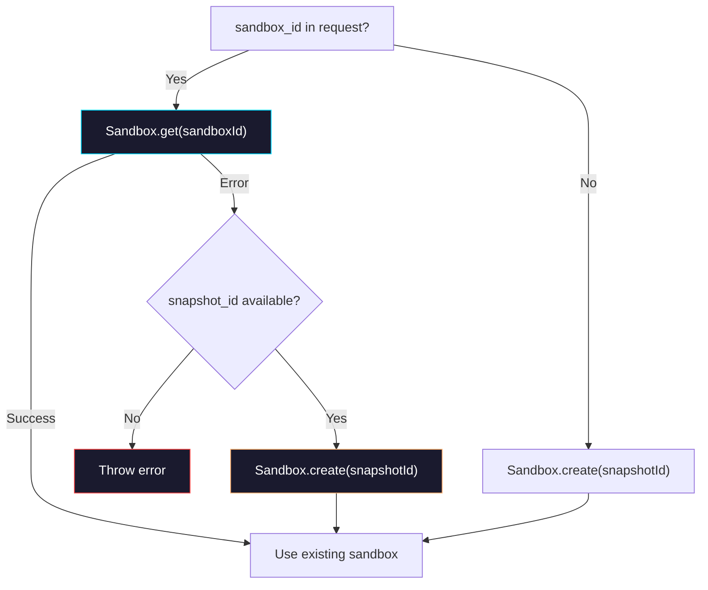

# Phase 1: Sandbox Expire Recovery

> **Epic:** [AGENTS.md](./AGENTS.md)
> **Dependencies:** Phase 0 (snapshotId is now in the store and passed as `snapshot_id` in runtimeInput)
> **Blocks:** Phase 2

## Objective

When `Sandbox.get({ sandboxId })` fails (because the sandbox has expired or been deleted), fall back to `Sandbox.create()` using the `snapshot_id` from the request. This makes sandbox expiration a transparent recovery instead of a fatal error.

## What You're Building



## Deliverables

### 1. `packages/agent/src/chat-run.ts` — Add Sandbox.get fallback

Replace the current sandbox resolution logic (L112-133):

**Before:**
```typescript
const sandbox = parsed.sandbox_id
  ? await Sandbox.get({ sandboxId: parsed.sandbox_id })
  : await (async () => {
      const snapshotId =
        parsed.snapshot_id?.trim() || input.agent.snapshotId?.trim();
      if (!snapshotId) {
        throw new Error(
          "Agent must provide snapshotId when sandbox_id is not provided.",
        );
      }
      const created = await Sandbox.create({
        source: { type: "snapshot", snapshotId },
      });
      console.log(
        `[sandbox] created sandbox=${created.sandboxId} from snapshot=${snapshotId}`,
      );
      return created;
    })();
```

**After:**
```typescript
const sandbox = await (async () => {
  if (parsed.sandbox_id) {
    try {
      return await Sandbox.get({ sandboxId: parsed.sandbox_id });
    } catch (error) {
      const snapshotId =
        parsed.snapshot_id?.trim() || input.agent.snapshotId?.trim();
      if (!snapshotId) {
        throw error;
      }
      console.log(
        `[sandbox] sandbox=${parsed.sandbox_id} expired, recreating from snapshot=${snapshotId}`,
      );
      const created = await Sandbox.create({
        source: { type: "snapshot", snapshotId },
      });
      console.log(
        `[sandbox] created sandbox=${created.sandboxId} from snapshot=${snapshotId}`,
      );
      return created;
    }
  }

  const snapshotId =
    parsed.snapshot_id?.trim() || input.agent.snapshotId?.trim();
  if (!snapshotId) {
    throw new Error(
      "Agent must provide snapshotId when sandbox_id is not provided.",
    );
  }
  const created = await Sandbox.create({
    source: { type: "snapshot", snapshotId },
  });
  console.log(
    `[sandbox] created sandbox=${created.sandboxId} from snapshot=${snapshotId}`,
  );
  return created;
})();
```

Key behaviors:
- If `sandbox_id` is present and `Sandbox.get()` succeeds → use existing sandbox (no change)
- If `sandbox_id` is present and `Sandbox.get()` fails AND `snapshot_id` is available → recreate from snapshot (new)
- If `sandbox_id` is present and `Sandbox.get()` fails AND no `snapshot_id` → rethrow the original error (preserves current behavior)
- If no `sandbox_id` → create from snapshot (no change)

## Verification

1. `pnpm --filter @giselles-ai/agent test` — all tests pass
2. `npx tsc --noEmit` in `packages/agent` — no type errors
3. **Manual verification scenario:**
   - Start a chat session (sandbox created, snapshot taken, stored in Redis)
   - Wait for sandbox to expire (or manually delete the sandbox)
   - Send another message with the same sessionId
   - Expected: system logs `[sandbox] sandbox=... expired, recreating from snapshot=...` and continues normally

## Files to Create/Modify

| File | Action |
|---|---|
| `packages/agent/src/chat-run.ts` | **Modify** — wrap `Sandbox.get()` in try/catch with snapshot fallback |

## Done Criteria

- [ ] `Sandbox.get()` failure with available `snapshot_id` triggers `Sandbox.create()` fallback
- [ ] `Sandbox.get()` failure without `snapshot_id` still throws (no silent failure)
- [ ] Recovery is logged with `[sandbox]` prefix for observability
- [ ] All existing tests pass
- [ ] Update the status in [AGENTS.md](./AGENTS.md) to `✅ DONE`
