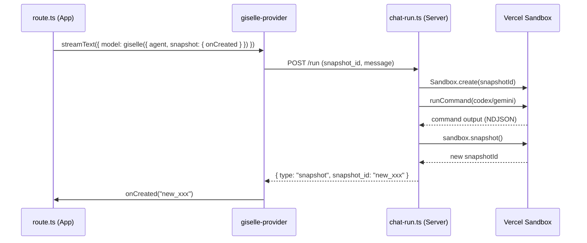
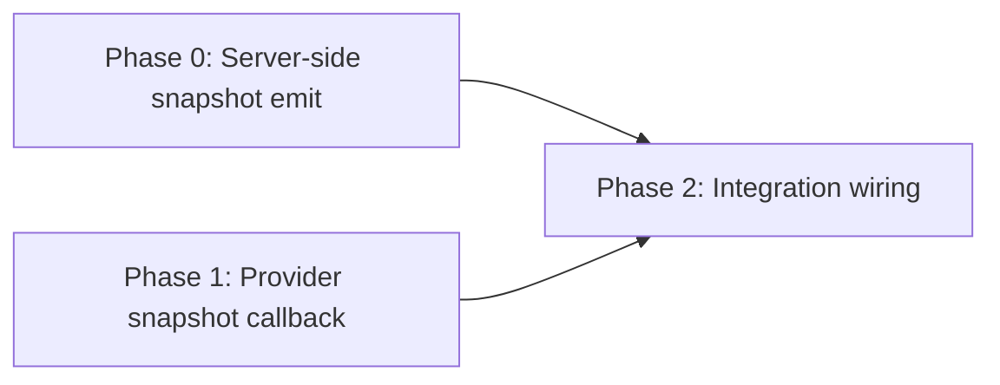

# Epic: Snapshot Callback

## Goal

After an agent run completes in the sandbox, the new snapshot ID is emitted as an NDJSON event
and surfaced to the client via a `snapshot.onCreated` callback on the `giselle()` provider.
This enables chat-room apps to persist per-room snapshot IDs to a database.

## Why

- Currently, after `runChat` executes a command in the sandbox, no snapshot is taken — the sandbox state is lost.
- Chat-room apps (like ChatGPT / Claude style UIs) need to persist `snapshotId` per conversation so the next message resumes from the latest state.
- There is no mechanism for the `giselle()` provider to notify the caller when a new snapshot is created.

## Architecture Overview



## Package / Directory Structure

```
packages/
  agent/src/
    chat-run.ts              ← MODIFY: add sandbox.snapshot() + emit event
    chat-run.test.ts         ← MODIFY: add test for snapshot event
  giselle-provider/src/
    types.ts                 ← MODIFY: add snapshot option to GiselleProviderOptions
    ndjson-mapper.ts         ← MODIFY: handle "snapshot" event, add snapshotId to MapResult
    giselle-agent-model.ts   ← MODIFY: invoke onCreated callback
    __tests__/
      ndjson-mapper.test.ts  ← MODIFY: add test for snapshot event mapping
      giselle-agent-model.test.ts ← MODIFY: add test for onCreated callback
```

## Task Dependency Graph



> Phases 0 and 1 can run **in parallel**.

## Task Status

| Phase | Task File | Status | Description |
|---|---|---|---|
| 0 | [phase-0-server-snapshot-emit.md](./phase-0-server-snapshot-emit.md) | ✅ DONE | Emit `{ type: "snapshot" }` event after agent run in `chat-run.ts` |
| 1 | [phase-1-provider-snapshot-callback.md](./phase-1-provider-snapshot-callback.md) | ✅ DONE | Add `snapshot.onCreated` to provider options, handle event in mapper + model |
| 2 | [phase-2-integration-wiring.md](./phase-2-integration-wiring.md) | ✅ DONE | Wire everything together, verify end-to-end in minimum-demo |

> **How to work on this epic:** Read this file first to understand the full architecture.
> Then check the status table above. Pick the first `🔲 TODO` task whose dependencies
> (see dependency graph) are `✅ DONE`. Open that task file and follow its instructions.
> When done, update the status in this table to `✅ DONE`.

## Key Conventions

- Monorepo: pnpm workspaces + Turborepo
- TypeScript strict mode, Biome for formatting/linting
- Tests: Vitest
- NDJSON events follow the pattern: `{ type: string, ...payload }` emitted via `enqueueEvent()` in `chat-run.ts`
- `MapResult` in `ndjson-mapper.ts` carries `parts`, `sessionUpdate`, and `relayRequest` — add `snapshotId` as a new optional field
- `GiselleAgentModel` processes `MapResult` in `processNdjsonObject` — this is where callbacks fire

## Existing Code Reference

| File | Relevance |
|---|---|
| `packages/agent/src/chat-run.ts` | Server-side agent run — lines 110–190 show sandbox creation + command execution. Snapshot must be added after `runCommand` completes. |
| `packages/giselle-provider/src/ndjson-mapper.ts` | Event mapper — `mapNdjsonEvent()` handles each NDJSON event type. Follow `event.type === "sandbox"` pattern (line 257). |
| `packages/giselle-provider/src/types.ts` | Provider options — `GiselleProviderOptions` type definition. |
| `packages/giselle-provider/src/giselle-agent-model.ts` | Model impl — `processNdjsonObject()` (line 258) processes mapped events. `runStream()` (line 159) is the outer loop. |
| `packages/giselle-provider/src/__tests__/ndjson-mapper.test.ts` | Test patterns for mapper. |
| `packages/giselle-provider/src/__tests__/giselle-agent-model.test.ts` | Test patterns for model. |
