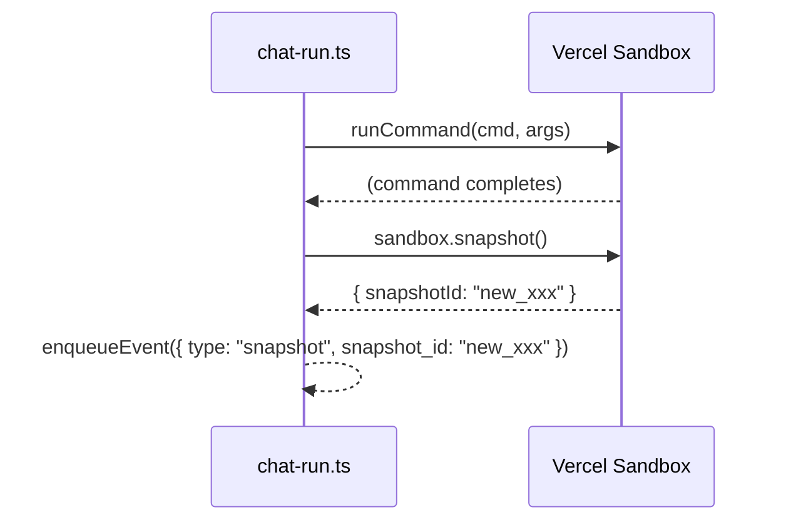

# Phase 0: Server-side Snapshot Emit

> **Epic:** [AGENTS.md](./AGENTS.md)
> **Dependencies:** None
> **Parallel with:** Phase 1
> **Blocks:** Phase 2

## Objective

After `runCommand` completes in `chat-run.ts`, call `sandbox.snapshot()` and emit
a `{ type: "snapshot", snapshot_id: "..." }` NDJSON event to the response stream.
This gives the client the new snapshot ID for persistence.

## What You're Building



## Deliverables

### 1. `packages/agent/src/chat-run.ts`

Add `sandbox.snapshot()` after the `runCommand` call (line 172) and before the `finally` block.
Emit the snapshot event using the existing `enqueueEvent` helper.

The change goes inside the `try` block, after `await sandbox.runCommand(...)`:

```typescript
// After line 172 (after runCommand completes):
const snapshot = await sandbox.snapshot();
enqueueEvent({ type: "snapshot", snapshot_id: snapshot.snapshotId });
```

**Important:** This must happen inside the `try` block so that if the command fails, no snapshot is taken.

### 2. `packages/agent/src/chat-run.test.ts`

Add a test case that verifies:
- After `runCommand` completes, `sandbox.snapshot()` is called
- The NDJSON stream contains a `{ type: "snapshot", snapshot_id: "..." }` event

Follow the existing test patterns in `chat-run.test.ts`. Mock `Sandbox.create` to return
a sandbox with a `snapshot` method that resolves to `{ snapshotId: "snap_after_run" }`.

## Verification

1. **Typecheck:** `cd packages/agent && npx tsc --noEmit`
2. **Tests:** `cd packages/agent && npx vitest run chat-run`
3. **Manual:** The NDJSON stream should now include a snapshot event as the last event before stream close.

## Files to Create/Modify

| File | Action |
|---|---|
| `packages/agent/src/chat-run.ts` | **Modify** — add `sandbox.snapshot()` + `enqueueEvent` after `runCommand` |
| `packages/agent/src/chat-run.test.ts` | **Modify** — add test for snapshot emit |

## Done Criteria

- [ ] `sandbox.snapshot()` is called after `runCommand` completes successfully
- [ ] `{ type: "snapshot", snapshot_id }` event is emitted to the NDJSON stream
- [ ] Test verifies snapshot event is present in stream output
- [ ] `npx tsc --noEmit` passes
- [ ] `npx vitest run chat-run` passes
- [ ] Update the status in [AGENTS.md](./AGENTS.md) to `✅ DONE`
