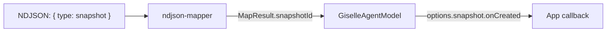

# Phase 1: Provider Snapshot Callback

> **Epic:** [AGENTS.md](./AGENTS.md)
> **Dependencies:** None
> **Parallel with:** Phase 0
> **Blocks:** Phase 2

## Objective

Add a `snapshot.onCreated` callback to `GiselleProviderOptions`, handle the `"snapshot"` NDJSON event
in the mapper, and invoke the callback from `GiselleAgentModel` when a snapshot event is received.

## What You're Building



## Deliverables

### 1. `packages/giselle-provider/src/types.ts`

Add `snapshot` option to `GiselleProviderOptions`:

```typescript
export type GiselleProviderOptions = {
	baseUrl?: string;
	apiKey?: string;
	headers?: Record<string, string | undefined>;
	agent: AgentRef;
	deps?: Partial<GiselleProviderDeps>;
	snapshot?: {
		onCreated?: (snapshotId: string) => void | Promise<void>;
	};
};
```

### 2. `packages/giselle-provider/src/ndjson-mapper.ts`

Add `snapshotId` to `MapResult`:

```typescript
export type MapResult = {
	parts: LanguageModelV3StreamPart[];
	sessionUpdate?: Record<string, unknown>;
	relayRequest?: Record<string, unknown>;
	snapshotId?: string;
};
```

Add a handler for `event.type === "snapshot"` in `mapNdjsonEvent()`, following the existing
`event.type === "sandbox"` pattern (line 257):

```typescript
if (event.type === "snapshot") {
	const snapshotId = asString(event.snapshot_id);
	if (!snapshotId) {
		return { parts };
	}
	return {
		parts,
		snapshotId,
	};
}
```

### 3. `packages/giselle-provider/src/giselle-agent-model.ts`

Modify `processNdjsonObject` to check for `snapshotId` in the mapped result and invoke the callback:

```typescript
private async processNdjsonObject(input: {
	controller: ReadableStreamDefaultController<LanguageModelV3StreamPart>;
	context: ReturnType<typeof createMapperContext>;
	objectText: string;
}): Promise<void> {
	// ... existing JSON parse ...

	const mapped = mapNdjsonEvent(event, input.context);
	for (const part of mapped.parts) {
		input.controller.enqueue(part);
	}

	// NEW: invoke snapshot callback
	if (mapped.snapshotId && this.options.snapshot?.onCreated) {
		try {
			await this.options.snapshot.onCreated(mapped.snapshotId);
		} catch (error) {
			console.error("[giselle-provider] snapshot.onCreated error:", error);
		}
	}
}
```

### 4. `packages/giselle-provider/src/__tests__/ndjson-mapper.test.ts`

Add a test:

```typescript
it("maps snapshot event to snapshotId", () => {
	const context = createMapperContext();
	const result = mapNdjsonEvent(
		{ type: "snapshot", snapshot_id: "snap_new_123" },
		context,
	);
	expect(result.snapshotId).toBe("snap_new_123");
});

it("ignores snapshot event without snapshot_id", () => {
	const context = createMapperContext();
	const result = mapNdjsonEvent({ type: "snapshot" }, context);
	expect(result.snapshotId).toBeUndefined();
});
```

### 5. `packages/giselle-provider/src/__tests__/giselle-agent-model.test.ts`

Add a test that verifies `onCreated` is called when a snapshot event is in the NDJSON stream.
Follow the existing test pattern that mocks `connectCloudApi` with an NDJSON body containing
`{ type: "snapshot", snapshot_id: "snap_test" }`.

## Verification

1. **Typecheck:** `cd packages/giselle-provider && npx tsc --noEmit`
2. **Tests:** `cd packages/giselle-provider && npx vitest run`
3. **Verify:** `onCreated` callback is invoked with the correct snapshot ID

## Files to Create/Modify

| File | Action |
|---|---|
| `packages/giselle-provider/src/types.ts` | **Modify** — add `snapshot` to `GiselleProviderOptions` |
| `packages/giselle-provider/src/ndjson-mapper.ts` | **Modify** — add `snapshotId` to `MapResult`, handle `"snapshot"` event |
| `packages/giselle-provider/src/giselle-agent-model.ts` | **Modify** — invoke `onCreated` callback |
| `packages/giselle-provider/src/__tests__/ndjson-mapper.test.ts` | **Modify** — add snapshot event tests |
| `packages/giselle-provider/src/__tests__/giselle-agent-model.test.ts` | **Modify** — add onCreated callback test |

## Done Criteria

- [ ] `GiselleProviderOptions` has `snapshot.onCreated` option
- [ ] `MapResult` has optional `snapshotId` field
- [ ] `mapNdjsonEvent` handles `event.type === "snapshot"`
- [ ] `processNdjsonObject` invokes `onCreated` when snapshotId is present
- [ ] Mapper tests pass for snapshot event
- [ ] Model test verifies onCreated is called
- [ ] `npx tsc --noEmit` passes
- [ ] `npx vitest run` passes
- [ ] Update the status in [AGENTS.md](./AGENTS.md) to `✅ DONE`
