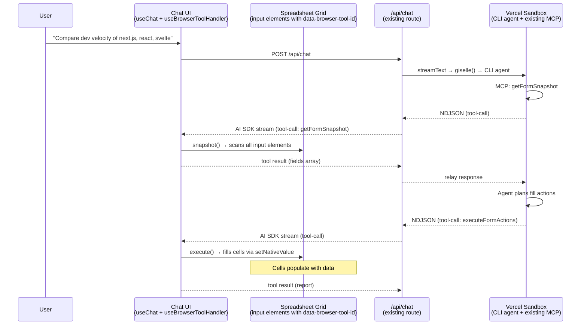
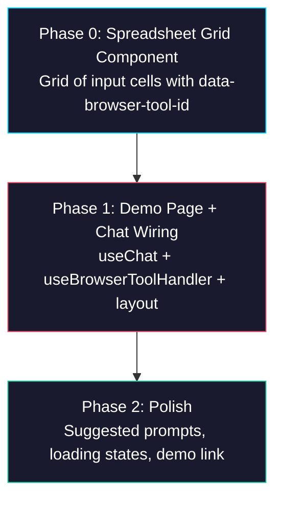

# Epic: Spreadsheet Input Demo — Browser Tool on a Grid UI

## Goal

Build a **spreadsheet-style demo page** at `/demo/spreadsheet` in `packages/web` that showcases the Sandbox Agent filling a dynamic grid of cells — using the **existing browser-tool** (`getFormSnapshot` + `executeFormActions`), existing `/api/chat` route, and existing MCP/relay infrastructure. No new tools, no new MCP server, no provider changes.

The spreadsheet cells are `<input>` elements with `data-browser-tool-id` attributes. From the browser-tool's perspective, a spreadsheet cell is just another form field. The agent snapshots the page, sees the cells, and fills them.

After this epic is complete:
- `/demo/spreadsheet` — Spreadsheet grid + Chat UI side by side
- All existing pages and packages remain unchanged

## Why

- The existing form-fill demos show a fixed set of fields. The spreadsheet demo shows the **same browser-tool** operating on a larger, more dynamic surface — proving it generalizes beyond simple forms.
- The demo must feel "different from typical chat AI, shows it actually operating an application." A spreadsheet filling up cell by cell is visually compelling.
- By reusing the existing browser-tool as-is, we validate the architecture: `snapshot()` / `execute()` are generic DOM operations, not form-specific logic.

## Architecture Overview



**Key insight:** Zero changes to `browser-tool`, `giselle-provider`, `sandbox-agent`, or MCP server. The spreadsheet is just a collection of `<input>` elements.

## Directory Structure

```
packages/web/app/
├── demo/
│   └── spreadsheet/
│       ├── page.tsx                        ← NEW (spreadsheet demo page)
│       └── _components/
│           └── spreadsheet-grid.tsx        ← NEW (grid of <input> cells)
├── api/chat/route.ts                      ← EXISTING (no changes)
├── codex-browser-tool/page.tsx            ← EXISTING (reference implementation)
└── demos/page.tsx                         ← MODIFY (add link)
```

## Task Dependency Graph



All phases are sequential — each builds on the previous.

## Task Status

| Phase | Task File | Status | Description |
|---|---|---|---|
| 0 | [phase-0-spreadsheet-grid.md](./phase-0-spreadsheet-grid.md) | ✅ DONE | Grid component with `<input>` cells + `data-browser-tool-id` |
| 1 | [phase-1-demo-page.md](./phase-1-demo-page.md) | ✅ DONE | Page layout, `useChat` + `useBrowserToolHandler`, side-by-side UI |
| 2 | [phase-2-polish.md](./phase-2-polish.md) | 🔲 TODO | Suggested prompts, loading indicator, clear button, demo link |

> **How to work on this epic:** Read this file first to understand the full architecture.
> Then check the status table above. Pick the first `🔲 TODO` task whose dependencies
> (see dependency graph) are `✅ DONE`. Open that task file and follow its instructions.
> When done, update the status in this table to `✅ DONE`.

## Key Conventions

- **Monorepo:** pnpm workspaces, `tsup` for building, `biome` for formatting
- **Framework:** Next.js 16, React 19, Tailwind CSS 4
- **AI SDK:** `ai@6.0.68`, `@ai-sdk/react@3.0.70`
- **Existing dark theme:** `slate` color palette, Geist + Tomorrow fonts
- **browser-tool integration:** `data-browser-tool-id` attribute on every `<input>` / `<select>` / `<textarea>`. `snapshot()` scans them, `execute()` fills them via `setNativeValue` + event dispatch.
- **Chat wiring pattern:** `useBrowserToolHandler()` → spread into `useChat()` → `browserTool.connect(addToolOutput)`. See `codex-browser-tool/page.tsx`.
- **No new dependencies** — use only what's in `packages/web/package.json`

## Existing Code Reference

| File | Relevance |
|---|---|
| `packages/web/app/codex-browser-tool/page.tsx` | **Primary reference** — copy this pattern for useChat + useBrowserToolHandler wiring |
| `packages/web/app/api/chat/route.ts` | Existing route — reuse as-is, no changes needed |
| `packages/browser-tool/src/react/use-chat-handler.ts` | `useBrowserToolHandler` — handles `getFormSnapshot` and `executeFormActions` |
| `packages/browser-tool/src/dom/snapshot.ts` | `snapshot()` — scans `input, textarea, select` with `data-browser-tool-id` |
| `packages/browser-tool/src/dom/executor.ts` | `execute()` — `setNativeValue` + `emitInputEvents` on matched elements |
| `packages/web/app/demos/page.tsx` | Demo index — add link to spreadsheet demo |

## Design Decisions

### Spreadsheet cells are `<input>` elements

Each cell is an `<input type="text">` with a `data-browser-tool-id` like `cell-0-0` (row-col). Column headers can also be inputs (`header-0`, `header-1`, …) or labels. The existing `snapshot()` picks them all up; `execute()` fills them via `fill` actions.

### Fixed grid size, agent fills what it needs

The grid starts with a fixed size (e.g., 10 rows × 6 columns) of empty `<input>` cells. The agent snapshots all cells, decides which to fill based on the user's prompt, and fills them. Unused cells remain empty. This avoids the need for dynamic row/column creation.

### Reuse `/api/chat` route directly

The existing route already has `getFormSnapshot` + `executeFormActions` tools and the full agent resolution pipeline. The chat transport just points at `/api/chat` with the desired agent type in `providerOptions`.

### Example Scenario

**Prompt:** "Compare development velocity of vercel/next.js, facebook/react, sveltejs/svelte over the past year. Also check which coding agents are used."

**Agent behavior:**
1. Calls `getFormSnapshot` → receives all grid cells as fields
2. Writes code in sandbox to fetch GitHub API data
3. Calls `executeFormActions` with `fill` actions → populates header cells + data cells
4. Returns summary text

**Resulting grid:**

| | A | B | C | D |
|---|---|---|---|---|
| 1 | Metric | next.js | react | svelte |
| 2 | Commits (12mo) | 2,340 | 890 | 1,200 |
| 3 | PRs Merged | 1,100 | 420 | 580 |
| 4 | Contributors | 380 | 210 | 150 |
| 5 | AI Agents | AGENTS.md | Copilot | — |
