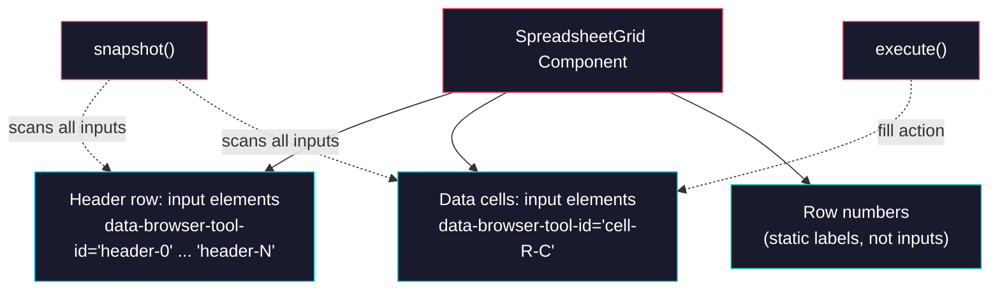

# Phase 0: Spreadsheet Grid Component

> **Epic:** [AGENTS.md](./AGENTS.md)
> **Dependencies:** None
> **Blocks:** Phase 1

## Objective

Build a spreadsheet-like grid component made of `<input>` elements, each tagged with `data-browser-tool-id`. This is the core UI that the existing browser-tool's `snapshot()` / `execute()` will operate on — no new tools needed.

## What You're Building



## Deliverables

### 1. `packages/web/app/demo/spreadsheet/_components/spreadsheet-grid.tsx`

A React component that renders a grid of `<input>` elements.

**Props:**

```ts
type SpreadsheetGridProps = {
  rows: number;    // default 10
  columns: number; // default 6
};
```

**Requirements:**

- Render a `<table>` with a header row and data rows
- **Header row:** Each header cell is an `<input>` with:
  - `data-browser-tool-id="header-{colIndex}"` (e.g., `header-0`, `header-1`)
  - `placeholder` like `"Column A"`, `"Column B"`, etc.
  - `aria-label="Header column {colIndex}"`
- **Data cells:** Each cell is an `<input>` with:
  - `data-browser-tool-id="cell-{rowIndex}-{colIndex}"` (e.g., `cell-0-0`, `cell-2-3`)
  - No placeholder (empty)
  - `aria-label="Cell row {rowIndex} column {colIndex}"`
- **Row numbers:** First column shows row numbers (1-indexed) as static `<td>` text, not inputs
- **Column letters:** Optional — show A, B, C… above headers like a real spreadsheet
- All inputs are controlled via local state (individual `useState` per cell or a single state map)
- Inputs should update local state on change so `snapshot()` reads current values
- Horizontally scrollable: `overflow-x-auto` wrapper
- Dark theme styling matching existing demos:
  - Table: `border-collapse`, cells with `border border-slate-700/50`
  - Header inputs: `bg-slate-900/80 text-slate-200 font-medium text-xs`
  - Data inputs: `bg-transparent text-slate-100 text-sm`
  - Row numbers: `text-slate-500 text-xs bg-slate-900/40`
  - Focus: `focus:outline-none focus:ring-1 focus:ring-cyan-500/50`
  - Compact cell padding: `px-2 py-1.5`

**Example rendered HTML (conceptual):**

```html
<table>
  <thead>
    <tr>
      <th></th> <!-- row number column -->
      <th><input data-browser-tool-id="header-0" placeholder="Column A" /></th>
      <th><input data-browser-tool-id="header-1" placeholder="Column B" /></th>
      ...
    </tr>
  </thead>
  <tbody>
    <tr>
      <td>1</td>
      <td><input data-browser-tool-id="cell-0-0" /></td>
      <td><input data-browser-tool-id="cell-0-1" /></td>
      ...
    </tr>
    <tr>
      <td>2</td>
      <td><input data-browser-tool-id="cell-1-0" /></td>
      <td><input data-browser-tool-id="cell-1-1" /></td>
      ...
    </tr>
  </tbody>
</table>
```

**State management:**

Use a single state object keyed by `data-browser-tool-id`:

```ts
const [cells, setCells] = useState<Record<string, string>>({});

const handleChange = (id: string, value: string) => {
  setCells((prev) => ({ ...prev, [id]: value }));
};

// Each input:
<input
  data-browser-tool-id={id}
  value={cells[id] ?? ""}
  onChange={(e) => handleChange(id, e.target.value)}
/>
```

This ensures `snapshot()` reads the current React-controlled values, and `execute()` via `setNativeValue` + `emitInputEvents` triggers the `onChange` handler to update state.

### 2. `packages/web/app/demo/spreadsheet/page.tsx` (temporary verification page)

A minimal page to verify the grid renders correctly. Will be replaced in Phase 1.

```tsx
import { SpreadsheetGrid } from "./_components/spreadsheet-grid";

export default function SpreadsheetDemoPage() {
  return (
    <main className="min-h-screen p-6 text-slate-100 sm:p-10">
      <h1 className="text-2xl font-semibold">Spreadsheet Demo</h1>
      <p className="mt-2 text-sm text-slate-400">
        Each cell is an input with data-browser-tool-id — the existing browser-tool operates on them.
      </p>
      <div className="mt-6">
        <SpreadsheetGrid rows={10} columns={6} />
      </div>
    </main>
  );
}
```

## Verification

1. **Typecheck:**
   ```bash
   pnpm --filter demo typecheck
   ```

2. **Dev server:**
   ```bash
   pnpm dev
   ```
   Navigate to `http://localhost:3000/demo/spreadsheet`:
   - Grid renders with 10 rows × 6 columns of empty inputs
   - Header row shows placeholder text (Column A, B, C…)
   - Row numbers (1–10) show in first column
   - Typing in a cell updates its value
   - Inspect DOM: every cell has `data-browser-tool-id` attribute

3. **Browser-tool compatibility check** (dev console):
   ```js
   // In browser console on the demo page:
   import('/path/to/snapshot').then(m => console.log(m.snapshot()))
   ```
   Or simply inspect the DOM — all `<input>` elements should have `data-browser-tool-id` attributes, which is what `snapshot()` uses.

4. **Format:**
   ```bash
   pnpm format
   ```

## Files to Create/Modify

| File | Action |
|---|---|
| `packages/web/app/demo/spreadsheet/_components/spreadsheet-grid.tsx` | **Create** |
| `packages/web/app/demo/spreadsheet/page.tsx` | **Create** (temporary) |

## Done Criteria

- [ ] `SpreadsheetGrid` renders a table of `<input>` cells
- [ ] Every header input has `data-browser-tool-id="header-{col}"`
- [ ] Every data input has `data-browser-tool-id="cell-{row}-{col}"`
- [ ] Row numbers shown as static text in first column
- [ ] Cells are controlled (typing updates state)
- [ ] Dark theme styling consistent with existing demo pages
- [ ] Horizontally scrollable for overflow
- [ ] `pnpm --filter demo typecheck` passes
- [ ] `pnpm format` passes
- [ ] Update the status in [AGENTS.md](./AGENTS.md) to `✅ DONE`
