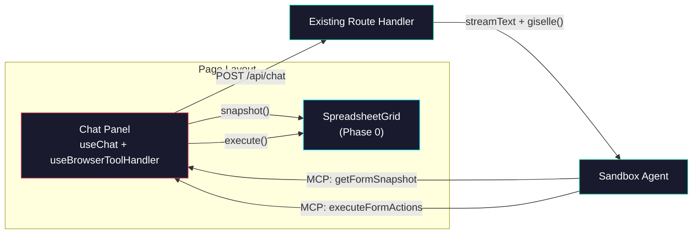

# Phase 1: Demo Page + Chat Wiring

> **Epic:** [AGENTS.md](./AGENTS.md)
> **Dependencies:** Phase 0 (grid component must exist)
> **Blocks:** Phase 2

## Objective

Build the full demo page with a side-by-side layout: spreadsheet grid on the left, chat panel on the right. Wire `useChat` + `useBrowserToolHandler` exactly like `codex-browser-tool/page.tsx` — pointing at the existing `/api/chat` route. After this phase, the demo is fully functional end-to-end.

## What You're Building



## Deliverables

### 1. Replace `packages/web/app/demo/spreadsheet/page.tsx`

Replace the Phase 0 temporary page with the full demo page. This is a `"use client"` component.

**Structure:** Follow the `codex-browser-tool/page.tsx` pattern closely:

```tsx
"use client";

import { useChat } from "@ai-sdk/react";
import { useBrowserToolHandler } from "@giselles-ai/browser-tool/react";
import {
  DefaultChatTransport,
  isToolUIPart,
  lastAssistantMessageIsCompleteWithToolCalls,
} from "ai";
import { type FormEvent, useCallback, useMemo, useState } from "react";
import { SpreadsheetGrid } from "./_components/spreadsheet-grid";
```

**Chat wiring** (same as codex-browser-tool):

```tsx
const browserTool = useBrowserToolHandler({
  onWarnings: (next) =>
    setWarnings((current) => [...new Set([...current, ...next])]),
});

const { status, messages, error, sendMessage, addToolOutput } = useChat({
  transport: new DefaultChatTransport({
    api: "/api/chat",
    body: {
      providerOptions: {
        giselle: {
          agent: { type: "codex" }, // or "gemini"
        },
      },
    },
  }),
  sendAutomaticallyWhen: lastAssistantMessageIsCompleteWithToolCalls,
  ...browserTool,
  onError: (chatError) => {
    console.error("Chat error", chatError);
  },
});

browserTool.connect(addToolOutput);
```

**Layout:**

```
┌───────────────────────────────────────────────────────────┐
│  ← Back to home                             agent: idle  │
├─────────────────────────────────┬─────────────────────────┤
│                                 │  Chat                   │
│  SpreadsheetGrid                │  ┌───────────────────┐  │
│  (10 rows × 6 cols)             │  │ Messages          │  │
│                                 │  │                   │  │
│                                 │  ├───────────────────┤  │
│                                 │  │ Document textarea │  │
│                                 │  ├───────────────────┤  │
│                                 │  │ [input] [Send]    │  │
│                                 │  └───────────────────┘  │
└─────────────────────────────────┴─────────────────────────┘
```

- CSS grid: `grid grid-cols-1 lg:grid-cols-[1.2fr_0.8fr] gap-4`
- Stacks vertically on mobile
- Spreadsheet in a rounded container with border (like the form in codex-browser-tool)
- Chat panel in a separate rounded container

**Chat panel features** (inline in the page, not a separate component):
- Scrollable message list rendering user/assistant messages
- "Document (optional)" textarea for pasting context
- Text input + send button
- Status indicator
- Error display
- Tool call activity: extract `isToolUIPart` parts, show tool name + state + collapsible details

**Reference:** Copy the message rendering, form handling, and tool parts display from `codex-browser-tool/page.tsx` lines 160–345. Adapt variable names but keep the exact same pattern.

### 2. Spreadsheet container header

Above the grid, add a small header:

```tsx
<div className="...">
  <p className="text-xs uppercase tracking-[0.18em] text-cyan-300/80">
    Sandbox Agent Spreadsheet
  </p>
  <h1 className="mt-2 text-xl font-semibold">
    Spreadsheet Demo
  </h1>
  <p className="mt-2 text-sm text-slate-300/90">
    The agent snapshots the grid, writes code in the sandbox, and fills cells with results.
  </p>
</div>
```

## Verification

1. **Typecheck:**
   ```bash
   pnpm --filter demo typecheck
   ```

2. **End-to-end test** (requires Cloud API credentials + valid snapshot):
   ```bash
   pnpm dev
   ```
   Navigate to `http://localhost:3000/demo/spreadsheet`:
   - Page shows spreadsheet grid (left) + chat (right)
   - Type "Fill the first row with the names of 5 programming languages" and send
   - The agent should call `getFormSnapshot` → see all cells
   - Then call `executeFormActions` → fill cells
   - Cells populate with values

3. **Without credentials:**
   - Page renders correctly with empty grid and chat panel
   - Sending a message shows an error (expected — no backend configured)

4. **Format:**
   ```bash
   pnpm format
   ```

## Files to Create/Modify

| File | Action |
|---|---|
| `packages/web/app/demo/spreadsheet/page.tsx` | **Modify** (replace temporary page with full demo) |

## Done Criteria

- [ ] Side-by-side layout: spreadsheet grid (left) + chat panel (right)
- [ ] `useChat` wired with `useBrowserToolHandler` (same as codex-browser-tool)
- [ ] Points at existing `/api/chat` route
- [ ] Message list, document textarea, input + send button all render
- [ ] Tool call activity is visible in the chat panel
- [ ] Status indicator works (idle / submitted / streaming)
- [ ] Responsive: stacks vertically on small screens
- [ ] `pnpm --filter demo typecheck` passes
- [ ] `pnpm format` passes
- [ ] Update the status in [AGENTS.md](./AGENTS.md) to `✅ DONE`
