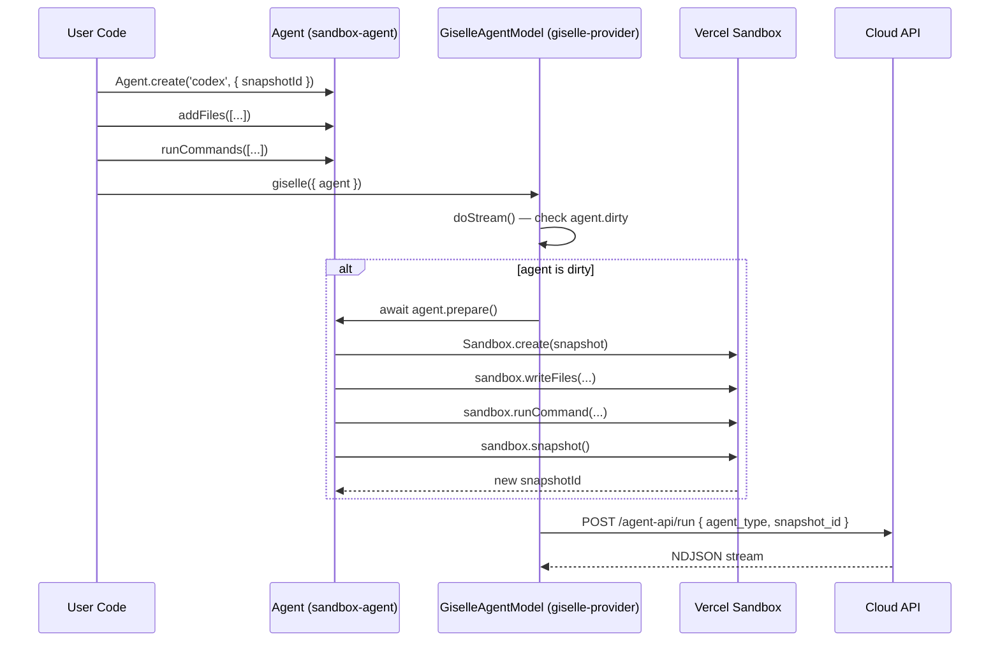
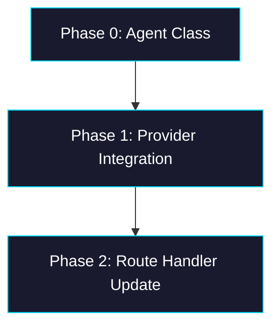

# Epic: Unified Agent Class

## Goal

Introduce a unified `Agent` class in `packages/sandbox-agent` that wraps a Vercel Sandbox snapshot and provides a fluent API for sandbox customization (`addFiles`, `runCommands`). The `giselle-provider` accepts `Agent` instances directly, automatically materializing pending mutations into a new snapshot before streaming. After this epic, the usage is:

```typescript
const agent = Agent.create('codex', { snapshotId: 'snap_abc' });
agent.addFiles([{ path: '/app/data.json', content: Buffer.from('...') }]);
agent.runCommands([{ cmd: 'npm', args: ['install', 'lodash'] }]);

streamText({
  model: giselle({ cloudApiUrl, headers, agent }),
  messages,
});
```

## Why

- No unified abstraction exists — consumers manually pass `{ type, snapshotId }` plain objects
- No way to customize a sandbox environment (add files, run setup commands) before an agent run
- The `GiselleAgentConfig` type is a loose bag of optional fields with no behavior
- A first-class `Agent` entity is needed as the foundation for future custom agent types

## Architecture Overview



## Package / Directory Structure

```
packages/
├── sandbox-agent/
│   └── src/
│       ├── agent.ts               ← NEW — Agent class
│       ├── agent.test.ts          ← NEW — Agent unit tests
│       ├── index.ts               ← MODIFY — add Agent export
│       └── agents/                ← EXISTING (unchanged)
│           ├── codex-agent.ts
│           ├── gemini-agent.ts
│           └── ...
├── giselle-provider/
│   ├── package.json               ← MODIFY — add sandbox-agent dep
│   └── src/
│       ├── types.ts               ← MODIFY — replace GiselleAgentConfig with Agent import
│       ├── giselle-agent-model.ts ← MODIFY — call agent.prepare() in doStream()
│       └── index.ts               ← MODIFY — update re-exports
└── web/
    └── app/api/chat/
        └── route.ts               ← MODIFY — use Agent.create()
```

## Task Dependency Graph



- **Phases are sequential** — each depends on the previous.

## Task Status

| Phase | Task File | Status | Description |
|---|---|---|---|
| 0 | [phase-0-agent-class.md](./phase-0-agent-class.md) | ✅ DONE | Create `Agent` class in `sandbox-agent` with `create`, `addFiles`, `runCommands`, `prepare` |
| 1 | [phase-1-provider-integration.md](./phase-1-provider-integration.md) | 🔲 TODO | Update `giselle-provider` to accept `Agent`, call `prepare()` in `doStream()` |
| 2 | [phase-2-route-handler.md](./phase-2-route-handler.md) | 🔲 TODO | Update `packages/web/app/api/chat/route.ts` to use `Agent.create()` |

> **How to work on this epic:** Read this file first to understand the full architecture.
> Then check the status table above. Pick the first `🔲 TODO` task whose dependencies
> (see dependency graph) are `✅ DONE`. Open that task file and follow its instructions.
> When done, update the status in this table to `✅ DONE`.

## Key Conventions

- **Monorepo:** pnpm workspaces, `tsup` for building, `biome` for formatting
- **TypeScript:** `strict`, target `ES2022`, module `ESNext`, moduleResolution `Bundler`
- **Zod version:** `4.3.6`
- **Vercel Sandbox SDK:** `1.6.0` — `sandbox.snapshot()` shuts down the sandbox after snapshotting
- **Testing:** `vitest`, mock `@vercel/sandbox` with `vi.mock()` (see existing tests)
- **Breaking changes OK:** This is a pre-launch project; prefer the simplest ideal implementation

## Existing Code Reference

| File | Relevance |
|---|---|
| `packages/sandbox-agent/src/chat-run.ts` | `ChatAgent` interface — the server-side agent abstraction (unchanged, coexists) |
| `packages/sandbox-agent/src/agents/codex-agent.ts` | Existing Codex factory — pattern reference for agent options |
| `packages/sandbox-agent/src/agents/gemini-agent.ts` | Existing Gemini factory — pattern reference |
| `packages/sandbox-agent/src/agents/codex-agent.test.ts` | Test patterns — `vi.mock('@vercel/sandbox')` usage |
| `packages/sandbox-agent/src/chat-run.test.ts` | Test patterns — sandbox mock setup |
| `packages/giselle-provider/src/types.ts` | `GiselleAgentConfig`, `GiselleProviderOptions` — types to change |
| `packages/giselle-provider/src/giselle-agent-model.ts` | `doStream()`, `connectCloudApi()` — where `prepare()` is called |
| `packages/giselle-provider/src/index.ts` | Provider factory + exports |
| `packages/web/app/api/chat/route.ts` | Current route handler — consumer of `giselle()` |
