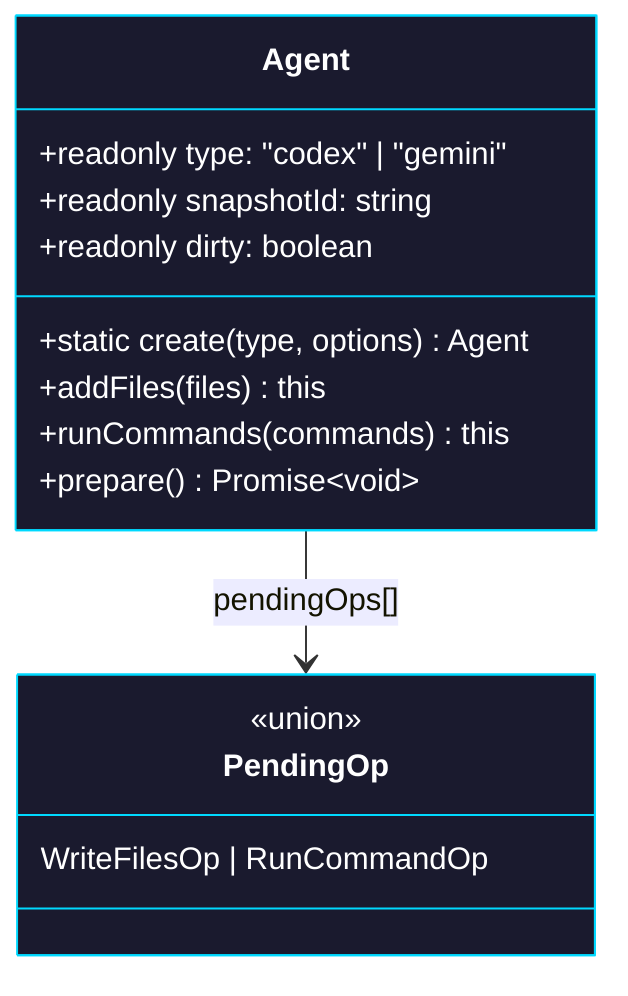

# Phase 0: Agent Class

> **Epic:** [AGENTS.md](./AGENTS.md)
> **Dependencies:** None
> **Blocks:** Phase 1

## Objective

Create the `Agent` class in `packages/sandbox-agent` — a client-side entity that wraps a Vercel Sandbox snapshot ID and agent type, with a fluent API for sandbox customization. Pending mutations are lazily queued and materialized into a new snapshot only when `prepare()` is called.

## What You're Building



## Deliverables

### 1. `packages/sandbox-agent/src/agent.ts`

Create the `Agent` class:

```typescript
import { Sandbox } from "@vercel/sandbox";

type AgentType = "codex" | "gemini";

type WriteFilesOp = {
  kind: "writeFiles";
  files: Array<{ path: string; content: Buffer }>;
};

type RunCommandOp = {
  kind: "runCommand";
  cmd: string;
  args: string[];
};

type PendingOp = WriteFilesOp | RunCommandOp;

export class Agent {
  private _type: AgentType;
  private _snapshotId: string;
  private _pendingOps: PendingOp[] = [];

  private constructor(type: AgentType, snapshotId: string) {
    this._type = type;
    this._snapshotId = snapshotId;
  }

  static create(
    type: AgentType,
    options: { snapshotId: string },
  ): Agent {
    const trimmed = options.snapshotId.trim();
    if (!trimmed) {
      throw new Error("snapshotId is required.");
    }
    return new Agent(type, trimmed);
  }

  get type(): AgentType {
    return this._type;
  }

  get snapshotId(): string {
    return this._snapshotId;
  }

  get dirty(): boolean {
    return this._pendingOps.length > 0;
  }

  addFiles(files: Array<{ path: string; content: Buffer }>): this {
    if (files.length === 0) return this;
    this._pendingOps.push({ kind: "writeFiles", files });
    return this;
  }

  runCommands(commands: Array<{ cmd: string; args?: string[] }>): this {
    for (const command of commands) {
      this._pendingOps.push({
        kind: "runCommand",
        cmd: command.cmd,
        args: command.args ?? [],
      });
    }
    return this;
  }

  /**
   * Materialize all pending operations into a new snapshot.
   *
   * This method is called internally by the giselle-provider's doStream()
   * before connecting to the Cloud API. It is a no-op when there are no
   * pending operations (dirty === false).
   *
   * Flow:
   * 1. Create a sandbox from the current snapshotId
   * 2. Apply all pending writeFiles and runCommand operations in order
   * 3. Take a snapshot (this shuts down the sandbox — Vercel SDK behavior)
   * 4. Update the internal snapshotId and clear the pending queue
   */
  async prepare(): Promise<void> {
    if (!this.dirty) return;

    const ops = this._pendingOps;
    this._pendingOps = [];

    const sandbox = await Sandbox.create({
      source: { type: "snapshot", snapshotId: this._snapshotId },
    });

    for (const op of ops) {
      switch (op.kind) {
        case "writeFiles":
          await sandbox.writeFiles(op.files);
          break;
        case "runCommand":
          await sandbox.runCommand(op.cmd, op.args);
          break;
      }
    }

    const snapshot = await sandbox.snapshot();
    this._snapshotId = snapshot.snapshotId;
  }
}
```

### 2. `packages/sandbox-agent/src/agent.test.ts`

Follow the existing test patterns (`vi.mock('@vercel/sandbox')`):

```typescript
import { beforeEach, describe, expect, it, vi } from "vitest";
import { Agent } from "./agent";

const { sandboxCreate } = vi.hoisted(() => ({
  sandboxCreate: vi.fn(),
}));

vi.mock("@vercel/sandbox", () => ({
  Sandbox: {
    create: sandboxCreate,
  },
}));

describe("Agent", () => {
  beforeEach(() => {
    sandboxCreate.mockReset();
  });

  describe("create", () => {
    it("creates an agent with type and snapshotId", () => {
      const agent = Agent.create("codex", { snapshotId: "snap_abc" });
      expect(agent.type).toBe("codex");
      expect(agent.snapshotId).toBe("snap_abc");
      expect(agent.dirty).toBe(false);
    });

    it("trims snapshotId", () => {
      const agent = Agent.create("gemini", { snapshotId: "  snap_abc  " });
      expect(agent.snapshotId).toBe("snap_abc");
    });

    it("throws on empty snapshotId", () => {
      expect(() => Agent.create("codex", { snapshotId: "" })).toThrow(
        "snapshotId is required",
      );
      expect(() => Agent.create("codex", { snapshotId: "   " })).toThrow(
        "snapshotId is required",
      );
    });
  });

  describe("addFiles", () => {
    it("marks agent as dirty", () => {
      const agent = Agent.create("codex", { snapshotId: "snap_abc" });
      agent.addFiles([{ path: "/app/data.json", content: Buffer.from("{}") }]);
      expect(agent.dirty).toBe(true);
    });

    it("is chainable", () => {
      const agent = Agent.create("codex", { snapshotId: "snap_abc" });
      const result = agent.addFiles([
        { path: "/a.txt", content: Buffer.from("a") },
      ]);
      expect(result).toBe(agent);
    });

    it("ignores empty array", () => {
      const agent = Agent.create("codex", { snapshotId: "snap_abc" });
      agent.addFiles([]);
      expect(agent.dirty).toBe(false);
    });
  });

  describe("runCommands", () => {
    it("marks agent as dirty", () => {
      const agent = Agent.create("codex", { snapshotId: "snap_abc" });
      agent.runCommands([{ cmd: "npm", args: ["install"] }]);
      expect(agent.dirty).toBe(true);
    });

    it("is chainable", () => {
      const agent = Agent.create("codex", { snapshotId: "snap_abc" });
      const result = agent.runCommands([{ cmd: "echo", args: ["hi"] }]);
      expect(result).toBe(agent);
    });
  });

  describe("prepare", () => {
    it("is a no-op when not dirty", async () => {
      const agent = Agent.create("codex", { snapshotId: "snap_abc" });
      await agent.prepare();
      expect(sandboxCreate).not.toHaveBeenCalled();
      expect(agent.snapshotId).toBe("snap_abc");
    });

    it("creates sandbox, applies ops, snapshots, and updates snapshotId", async () => {
      const writeFiles = vi.fn(async () => undefined);
      const runCommand = vi.fn(async () => undefined);
      const snapshot = vi.fn(async () => ({ snapshotId: "snap_new" }));
      sandboxCreate.mockResolvedValue({
        writeFiles,
        runCommand,
        snapshot,
      });

      const agent = Agent.create("codex", { snapshotId: "snap_abc" });
      agent
        .addFiles([{ path: "/a.txt", content: Buffer.from("hello") }])
        .runCommands([{ cmd: "npm", args: ["install"] }]);

      await agent.prepare();

      expect(sandboxCreate).toHaveBeenCalledWith({
        source: { type: "snapshot", snapshotId: "snap_abc" },
      });
      expect(writeFiles).toHaveBeenCalledWith([
        { path: "/a.txt", content: Buffer.from("hello") },
      ]);
      expect(runCommand).toHaveBeenCalledWith("npm", ["install"]);
      expect(snapshot).toHaveBeenCalled();
      expect(agent.snapshotId).toBe("snap_new");
      expect(agent.dirty).toBe(false);
    });

    it("applies operations in order", async () => {
      const callOrder: string[] = [];
      const writeFiles = vi.fn(async () => {
        callOrder.push("writeFiles");
      });
      const runCommand = vi.fn(async (cmd: string) => {
        callOrder.push(`runCommand:${cmd}`);
      });
      const snapshot = vi.fn(async () => ({ snapshotId: "snap_new" }));
      sandboxCreate.mockResolvedValue({
        writeFiles,
        runCommand,
        snapshot,
      });

      const agent = Agent.create("gemini", { snapshotId: "snap_abc" });
      agent
        .addFiles([{ path: "/a.txt", content: Buffer.from("a") }])
        .runCommands([{ cmd: "apt", args: ["install", "curl"] }])
        .addFiles([{ path: "/b.txt", content: Buffer.from("b") }]);

      await agent.prepare();

      expect(callOrder).toEqual([
        "writeFiles",
        "runCommand:apt",
        "writeFiles",
      ]);
    });
  });
});
```

### 3. `packages/sandbox-agent/src/index.ts`

Add the `Agent` export:

```diff
+export { Agent } from "./agent";
 export { createCodexAgent } from "./agents/codex-agent";
 export { createCodexStdoutMapper } from "./agents/codex-mapper";
 export { createGeminiAgent } from "./agents/gemini-agent";
 export {
   type BaseChatRequest,
   type ChatAgent,
   type ChatCommand,
   type RunChatInput,
   runChat,
   type StdoutMapper,
 } from "./chat-run";
```

## Verification

1. **Typecheck:**
   ```bash
   cd packages/sandbox-agent && pnpm typecheck
   ```

2. **Tests:**
   ```bash
   cd packages/sandbox-agent && pnpm test
   ```

3. **Build:**
   ```bash
   cd packages/sandbox-agent && pnpm build
   ```

## Files to Create/Modify

| File | Action |
|---|---|
| `packages/sandbox-agent/src/agent.ts` | **Create** |
| `packages/sandbox-agent/src/agent.test.ts` | **Create** |
| `packages/sandbox-agent/src/index.ts` | **Modify** (add `Agent` export) |

## Done Criteria

- [ ] `Agent.create()` returns an `Agent` instance with `type`, `snapshotId`, `dirty`
- [ ] `addFiles()` and `runCommands()` are chainable and mark the agent as dirty
- [ ] `prepare()` creates a sandbox, applies ops in order, takes a snapshot, updates snapshotId
- [ ] `prepare()` is a no-op when not dirty
- [ ] All tests pass: `pnpm test`
- [ ] Typecheck passes: `pnpm typecheck`
- [ ] Build succeeds: `pnpm build`
- [ ] Update the status in [AGENTS.md](./AGENTS.md) to `✅ DONE`
