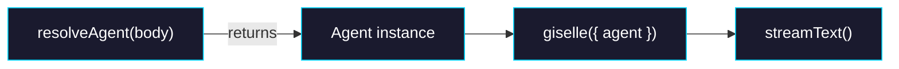

# Phase 2: Route Handler Update

> **Epic:** [AGENTS.md](./AGENTS.md)
> **Dependencies:** Phase 1 (provider must accept `Agent`)
> **Blocks:** None

## Objective

Update `packages/web/app/api/chat/route.ts` to use `Agent.create()` instead of returning a `ResolvedAgentConfig` plain object. This is the final consumer-side change that completes the migration.

## What You're Building



## Deliverables

### 1. `packages/web/app/api/chat/route.ts`

**Changes overview:**
- Import `Agent` from `@giselles-ai/sandbox-agent`
- Replace `ResolvedAgentConfig` type and `resolveAgentConfig()` with a `resolveAgent()` function that returns an `Agent`
- `agent` is now required — `resolveAgent()` always returns an `Agent` (defaults: type → `'gemini'`, snapshotId → `process.env.SANDBOX_SNAPSHOT_ID`)
- Pass `agent` directly to `giselle()` (no more optional)

**Specific changes:**

#### a. Update imports

```diff
+import { Agent } from "@giselles-ai/sandbox-agent";
 import { giselle } from "@giselles-ai/giselle-provider";
```

#### b. Remove old types

Delete `ResolvedAgentType` and `ResolvedAgentConfig` types entirely:

```typescript
// DELETE these:
type ResolvedAgentType = "gemini" | "codex";
type ResolvedAgentConfig = {
  type?: ResolvedAgentType;
  snapshotId?: string;
};
```

#### c. Replace `resolveAgentConfig()` with `resolveAgent()`

The new function always returns an `Agent`. It resolves type and snapshotId from request body or env vars, with sensible defaults:

```typescript
function resolveAgent(body: ChatRequestBody): Agent {
  const providerOptions = asRecord(body.providerOptions);
  const giselleOptions = asRecord(providerOptions?.giselle);
  const agentOptions = asRecord(giselleOptions?.agent);

  const type = resolveAgentType(agentOptions?.type)
    ?? resolveAgentType(process.env.AGENT_TYPE)
    ?? "gemini";

  const snapshotId = resolveAgentSnapshotId(agentOptions?.snapshotId)
    ?? resolveAgentSnapshotId(process.env.SANDBOX_SNAPSHOT_ID)
    ?? requiredEnv("SANDBOX_SNAPSHOT_ID");

  return Agent.create(type, { snapshotId });
}
```

Note: `resolveAgentType()` and `resolveAgentSnapshotId()` helper functions stay as-is — they still parse and validate input values. Only the `resolveAgentConfig()` function that assembles the result is replaced.

#### d. Update `POST` handler

```diff
 const agent = resolveAgent(body);

 const result = streamText({
   model: giselle({
     cloudApiUrl: CLOUD_API_URL,
     headers: buildCloudApiHeaders(),
-    agent,    // was: agent?: ResolvedAgentConfig | undefined
+    agent,    // Agent instance (always present)
   }),
   messages: await convertToModelMessages(messages),
   tools,
   providerOptions,
   abortSignal: request.signal,
 });
```

The overall structure of the `POST` handler stays the same. The only change is how `agent` is created.

## Verification

1. **Typecheck the web package:**
   ```bash
   cd packages/web && pnpm typecheck
   ```

2. **Typecheck the full workspace:**
   ```bash
   pnpm typecheck
   ```

3. **Build all packages:**
   ```bash
   pnpm build
   ```

4. **Manual verification:** Start the dev server and confirm the chat route responds correctly:
   ```bash
   cd packages/web && pnpm dev
   ```
   Send a test message via the UI and confirm agent streaming works.

## Files to Create/Modify

| File | Action |
|---|---|
| `packages/web/app/api/chat/route.ts` | **Modify** (import `Agent`, replace `resolveAgentConfig` → `resolveAgent`, remove `ResolvedAgentConfig` type) |

## Done Criteria

- [ ] `Agent` is imported from `@giselles-ai/sandbox-agent`
- [ ] `ResolvedAgentType` and `ResolvedAgentConfig` types are deleted
- [ ] `resolveAgentConfig()` is replaced with `resolveAgent()` returning `Agent`
- [ ] `resolveAgent()` defaults type to `'gemini'` and reads snapshotId from env
- [ ] `giselle({ agent })` receives an `Agent` instance directly
- [ ] `pnpm typecheck` passes across the full workspace
- [ ] `pnpm build` succeeds
- [ ] Update the status in [AGENTS.md](./AGENTS.md) to `✅ DONE`
