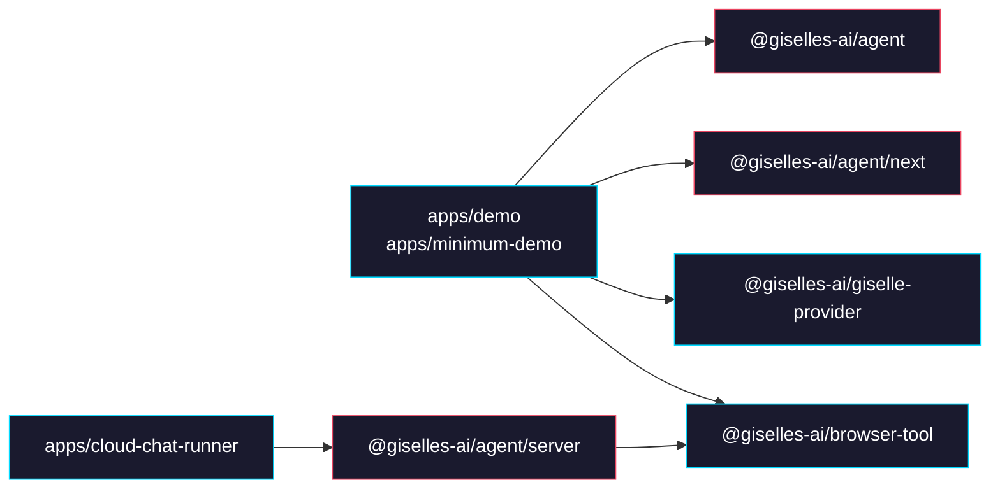
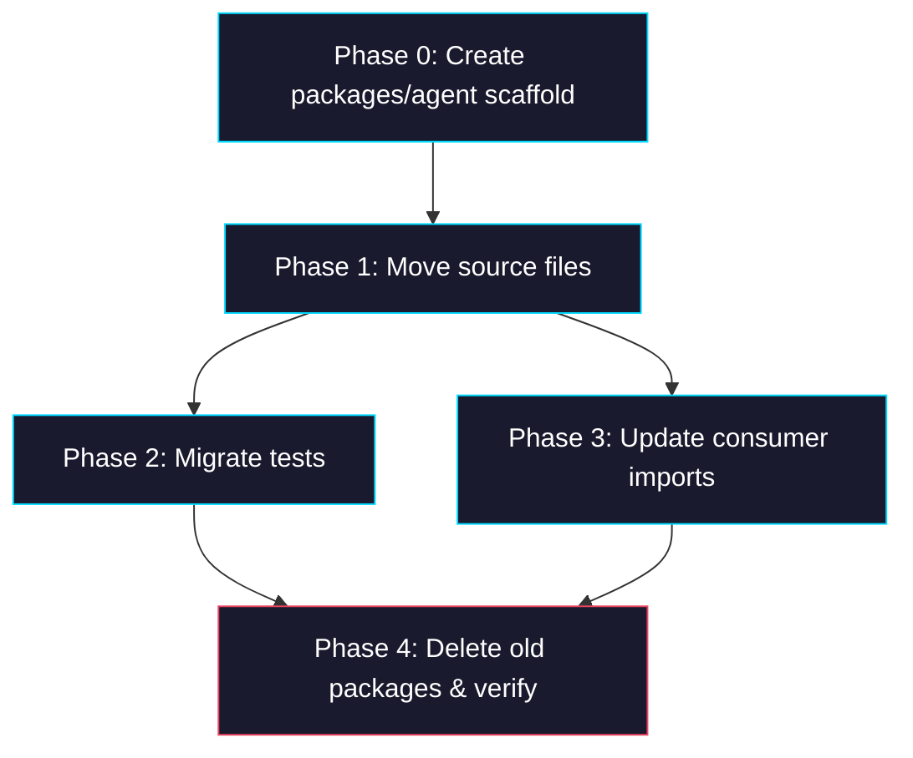

# Epic: Unify `agent-builder` + `agent-runtime` → `@giselles-ai/agent`

> **GitHub Epic:** #TBD · **Sub-issues:** #TBD–#TBD (Phases 0–4)

## Goal

Merge `agent-builder` and `agent-runtime` into a single `@giselles-ai/agent` package. Once complete, the entire agent lifecycle — define → build → run — is served by one package with three sub-path exports: `@giselles-ai/agent` (definitions), `@giselles-ai/agent/next` (Next.js plugin), and `@giselles-ai/agent/server` (server API). `packages/agent-builder` and `packages/agent-runtime` are deleted.

## Why

- After moving build logic into `agent-runtime`, `agent-builder` only contains `defineAgent` + `withGiselleAgent` — too thin to justify its own package
- `agent-runtime` now owns run + relay + build, but the name "runtime" no longer reflects its actual scope
- Consumers (`demo`, `cloud-chat-runner`) must import from two packages; a single package simplifies dependency management
- The define → build → run flow completes within one package, giving a clearer mental model

## Architecture Overview



## Package / Directory Structure

```text
packages/
├── agent/                            ← NEW (unified package)
│   ├── src/
│   │   ├── index.ts                  ← defineAgent, types, computeConfigHash
│   │   ├── next/                     ← withGiselleAgent (Next.js config plugin)
│   │   │   ├── index.ts
│   │   │   ├── with-giselle-agent.ts
│   │   │   └── types.ts
│   │   ├── server/                   ← createAgentApi, runCloudChat, etc.
│   │   │   └── index.ts
│   │   ├── define-agent.ts           ← FROM agent-builder
│   │   ├── hash.ts                   ← FROM agent-builder
│   │   ├── types.ts                  ← FROM agent-builder
│   │   ├── agent-api.ts              ← FROM agent-runtime
│   │   ├── agent.ts                  ← FROM agent-runtime
│   │   ├── build.ts                  ← FROM agent-runtime
│   │   ├── chat-run.ts               ← FROM agent-runtime
│   │   ├── cloud-chat.ts             ← FROM agent-runtime
│   │   ├── cloud-chat-live.ts        ← FROM agent-runtime
│   │   ├── cloud-chat-relay.ts       ← FROM agent-runtime
│   │   ├── cloud-chat-state.ts       ← FROM agent-runtime
│   │   └── agents/                   ← FROM agent-runtime
│   │       ├── create-agent.ts
│   │       ├── codex-agent.ts
│   │       ├── codex-mapper.ts
│   │       └── gemini-agent.ts
│   ├── package.json
│   ├── tsconfig.json
│   └── tsup.ts
├── agent-builder/                    ← DELETE
├── agent-runtime/                    ← DELETE
├── browser-tool/                     ← EXISTING (unchanged)
└── giselle-provider/                 ← EXISTING (unchanged)
```

## Task Dependency Graph



Phases 2 and 3 can run in parallel after Phase 1 is complete. Phase 4 waits for both to finish.

## Task Status

| Phase | Task File | Status | Description |
|---|---|---|---|
| 0 | [phase-0-package-scaffold.md](./phase-0-package-scaffold.md) | ✅ DONE | Create `packages/agent` with package.json, tsconfig, tsup, and sub-path exports |
| 1 | [phase-1-move-source.md](./phase-1-move-source.md) | ✅ DONE | Move source files from both packages into `packages/agent/src` and fix internal imports |
| 2 | [phase-2-migrate-tests.md](./phase-2-migrate-tests.md) | ✅ DONE | Move test files, update import paths, and verify all tests pass |
| 3 | [phase-3-update-consumers.md](./phase-3-update-consumers.md) | ✅ DONE | Rewrite `apps/` imports to `@giselles-ai/agent` and update package.json dependencies |
| 4 | [phase-4-cleanup.md](./phase-4-cleanup.md) | ✅ DONE | Delete old packages, reinstall, and run full build/typecheck/test verification |

> **How to work on this epic:** Read this file first to understand the full architecture.
> Then check the status table above. Pick the first `✅ DONE` task whose dependencies
> (see dependency graph) are `✅ DONE`. Open that task file and follow its instructions.
> When done, update the status in this table to `✅ DONE`.

## Key Conventions

- Monorepo uses `pnpm` workspaces + `turbo`
- Package builds use `tsup` (multi-entry); type checking uses `tsc --noEmit`
- Pre-public launch — breaking renames are acceptable; no compatibility shims needed
- Sub-path export pattern follows `browser-tool`'s existing setup (`.`, `./relay`, `./react`)
- Tests run with `vitest` (`pnpm exec vitest run`)
- Formatter is `biome` (`pnpm exec biome check --write .`)

## Existing Code Reference

| File | Relevance |
|---|---|
| `packages/agent-builder/package.json` | Source package's exports, dependencies, peerDependencies |
| `packages/agent-builder/tsup.ts` | Multi-entry build config pattern |
| `packages/agent-builder/src/index.ts` | `.` entry point export list |
| `packages/agent-builder/src/next/index.ts` | `./next` entry point export list |
| `packages/agent-builder/src/define-agent.ts` | defineAgent implementation |
| `packages/agent-builder/src/hash.ts` | computeConfigHash implementation |
| `packages/agent-builder/src/types.ts` | AgentConfig, DefinedAgent, AgentFile types |
| `packages/agent-builder/src/next/with-giselle-agent.ts` | Next.js plugin implementation |
| `packages/agent-builder/src/next/types.ts` | GiselleAgentPluginOptions type |
| `packages/agent-runtime/package.json` | Source package's exports, dependencies |
| `packages/agent-runtime/tsup.ts` | Single-entry build config |
| `packages/agent-runtime/src/index.ts` | Server entry point export list |
| `packages/agent-runtime/src/agent-api.ts` | createAgentApi implementation (includes merged build logic) |
| `packages/agent-runtime/src/build.ts` | buildAgent implementation |
| `packages/browser-tool/package.json` | Reference pattern for sub-path exports |
| `packages/browser-tool/tsup.ts` | Reference for multi-entry tsup config |
| `apps/demo/next.config.ts` | Usage of `@giselles-ai/agent-builder/next` |
| `apps/demo/lib/agent.ts` | Usage of `@giselles-ai/agent-builder` |
| `apps/demo/package.json` | Dependency to update |
| `apps/minimum-demo/next.config.ts` | Same as demo |
| `apps/minimum-demo/lib/agent.ts` | Same as demo |
| `apps/minimum-demo/package.json` | Same as demo |
| `apps/cloud-chat-runner/app/agent-api/[[...path]]/route.ts` | Usage of `@giselles-ai/agent-runtime` |
| `apps/cloud-chat-runner/app/agent-api/_lib/chat-state-store.ts` | Same as above |
| `apps/cloud-chat-runner/package.json` | Dependency to update |

## Domain-Specific Reference

### Sub-path Export Mapping

| Old import | New import |
|---|---|
| `@giselles-ai/agent-builder` | `@giselles-ai/agent` |
| `@giselles-ai/agent-builder/next` | `@giselles-ai/agent/next` |
| `@giselles-ai/agent-builder/next-server` | Removed (build is now part of `/server`) |
| `@giselles-ai/agent-runtime` | `@giselles-ai/agent/server` |

### Source File Origin Mapping

| Destination (packages/agent/src/) | Origin |
|---|---|
| `define-agent.ts` | `agent-builder/src/define-agent.ts` |
| `hash.ts` | `agent-builder/src/hash.ts` |
| `types.ts` | `agent-builder/src/types.ts` |
| `next/with-giselle-agent.ts` | `agent-builder/src/next/with-giselle-agent.ts` |
| `next/types.ts` | `agent-builder/src/next/types.ts` |
| `next/index.ts` | `agent-builder/src/next/index.ts` |
| `server/index.ts` | `agent-runtime/src/index.ts` (re-export) |
| `agent-api.ts` | `agent-runtime/src/agent-api.ts` |
| `agent.ts` | `agent-runtime/src/agent.ts` |
| `build.ts` | `agent-runtime/src/build.ts` |
| `chat-run.ts` | `agent-runtime/src/chat-run.ts` |
| `cloud-chat.ts` | `agent-runtime/src/cloud-chat.ts` |
| `cloud-chat-live.ts` | `agent-runtime/src/cloud-chat-live.ts` |
| `cloud-chat-relay.ts` | `agent-runtime/src/cloud-chat-relay.ts` |
| `cloud-chat-state.ts` | `agent-runtime/src/cloud-chat-state.ts` |
| `agents/*` | `agent-runtime/src/agents/*` |
