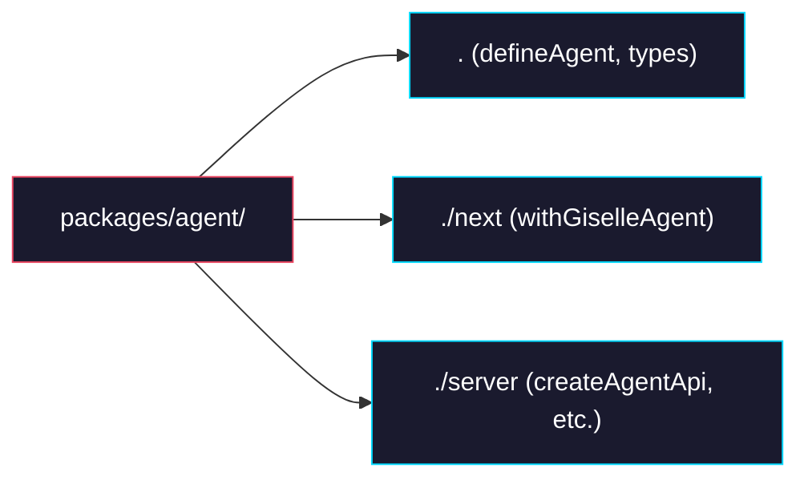

# Phase 0: Create `packages/agent` scaffold

> **GitHub Issue:** #TBD · **Epic:** [AGENTS.md](./AGENTS.md)
> **Dependencies:** None
> **Blocks:** Phase 1

## Objective

Create the `packages/agent` directory with package.json, tsconfig.json, and tsup.ts, defining three sub-path exports (`.`, `./next`, `./server`). Source files are placeholder-only in this phase. The scaffold must pass `pnpm install` and `pnpm turbo run build --filter=@giselles-ai/agent`.

## What You're Building



## Deliverables

### 1. `packages/agent/package.json`

Merge dependencies from both source packages and define three sub-path exports.

```json
{
  "name": "@giselles-ai/agent",
  "version": "0.1.0",
  "type": "module",
  "sideEffects": false,
  "license": "Apache-2.0",
  "repository": {
    "type": "git",
    "url": "https://github.com/giselles-ai/agent-container.git",
    "directory": "packages/agent"
  },
  "files": ["dist"],
  "exports": {
    ".": {
      "types": "./dist/index.d.ts",
      "import": "./dist/index.js",
      "default": "./dist/index.js"
    },
    "./next": {
      "types": "./dist/next/index.d.ts",
      "import": "./dist/next/index.js",
      "default": "./dist/next/index.js"
    },
    "./server": {
      "types": "./dist/server/index.d.ts",
      "import": "./dist/server/index.js",
      "default": "./dist/server/index.js"
    }
  },
  "scripts": {
    "build": "pnpm clean && tsup --config tsup.ts",
    "clean": "rm -rf dist *.tsbuildinfo",
    "typecheck": "tsc -p tsconfig.json --noEmit",
    "test": "pnpm exec vitest run",
    "format": "pnpm exec biome check --write ."
  },
  "dependencies": {
    "@giselles-ai/browser-tool": "workspace:*",
    "@vercel/sandbox": "1.6.0",
    "@iarna/toml": "3.0.0",
    "zod": "4.3.6"
  },
  "devDependencies": {
    "@google/gemini-cli-core": "0.29.5",
    "@types/node": "25.3.0",
    "@types/react": "19.2.14",
    "@types/react-dom": "19.2.3",
    "tsup": "8.5.1",
    "typescript": "5.9.3"
  },
  "peerDependencies": {
    "next": ">=15.0.0"
  },
  "peerDependenciesMeta": {
    "next": {
      "optional": true
    }
  }
}
```

### 2. `packages/agent/tsconfig.json`

Inherits from the base tsconfig with JSX support (carried over from `agent-runtime`).

```json
{
  "extends": "../../tsconfig.base.json",
  "compilerOptions": {
    "jsx": "react-jsx",
    "types": ["node", "react"],
    "noEmit": true
  },
  "include": ["src/**/*.ts", "src/**/*.tsx"],
  "exclude": ["node_modules", "dist"]
}
```

### 3. `packages/agent/tsup.ts`

Multi-entry build config for all three entry points. Follows the pattern from `agent-builder/tsup.ts`.

```ts
import { defineConfig } from "tsup";

export default defineConfig([
  {
    entry: ["src/index.ts", "src/next/index.ts", "src/server/index.ts"],
    outDir: "dist",
    format: ["esm"],
    dts: true,
  },
]);
```

### 4. Placeholder index files

Temporary entry points until Phase 1 moves the real source files.

**`packages/agent/src/index.ts`**:
```ts
export {};
```

**`packages/agent/src/next/index.ts`**:
```ts
export {};
```

**`packages/agent/src/server/index.ts`**:
```ts
export {};
```

## Verification

1. `pnpm install` succeeds
2. `pnpm turbo run build --filter=@giselles-ai/agent` succeeds and produces `dist/index.js`, `dist/index.d.ts`, `dist/next/index.js`, `dist/next/index.d.ts`, `dist/server/index.js`, `dist/server/index.d.ts`
3. `npx tsc --noEmit` succeeds inside `packages/agent`

```bash
pnpm install
pnpm turbo run build --filter=@giselles-ai/agent
ls packages/agent/dist/index.js packages/agent/dist/next/index.js packages/agent/dist/server/index.js
cd packages/agent && npx tsc --noEmit
```

## Files to Create/Modify

| File | Action |
|---|---|
| `packages/agent/package.json` | **Create** |
| `packages/agent/tsconfig.json` | **Create** |
| `packages/agent/tsup.ts` | **Create** |
| `packages/agent/src/index.ts` | **Create** (placeholder) |
| `packages/agent/src/next/index.ts` | **Create** (placeholder) |
| `packages/agent/src/server/index.ts` | **Create** (placeholder) |

## Done Criteria

- [ ] `packages/agent/` directory exists with all 6 files listed above
- [ ] `pnpm install` succeeds
- [ ] `pnpm turbo run build --filter=@giselles-ai/agent` succeeds
- [ ] `dist/` contains `.js` and `.d.ts` for all 3 entry points
- [ ] Update the status in [AGENTS.md](./AGENTS.md) to `✅ DONE`
