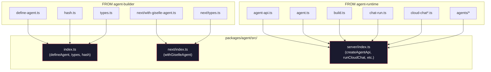

# Phase 1: Move source files

> **GitHub Issue:** #TBD · **Epic:** [AGENTS.md](./AGENTS.md)
> **Dependencies:** Phase 0
> **Parallel with:** —
> **Blocks:** Phase 2, Phase 3

## Objective

Move all source files from `agent-builder` and `agent-runtime` into `packages/agent/src/`, then wire up the three sub-path exports (`.`, `./next`, `./server`) with the correct re-exports. The build must pass with `pnpm turbo run build --filter=@giselles-ai/agent`.

## What You're Building



## Deliverables

### 1. Move files from `agent-builder/src/`

Copy the following files into `packages/agent/src/`. No internal import path changes are needed — relative paths are preserved by the directory structure.

| Source | Destination |
|---|---|
| `agent-builder/src/define-agent.ts` | `agent/src/define-agent.ts` |
| `agent-builder/src/hash.ts` | `agent/src/hash.ts` |
| `agent-builder/src/types.ts` | `agent/src/types.ts` |
| `agent-builder/src/next/with-giselle-agent.ts` | `agent/src/next/with-giselle-agent.ts` |
| `agent-builder/src/next/types.ts` | `agent/src/next/types.ts` |

Verify that `with-giselle-agent.ts` relative imports to `../hash` and `../types` still resolve correctly.

### 2. Move files from `agent-runtime/src/`

Copy the following files into `packages/agent/src/`.

| Source | Destination |
|---|---|
| `agent-runtime/src/agent-api.ts` | `agent/src/agent-api.ts` |
| `agent-runtime/src/agent.ts` | `agent/src/agent.ts` |
| `agent-runtime/src/build.ts` | `agent/src/build.ts` |
| `agent-runtime/src/chat-run.ts` | `agent/src/chat-run.ts` |
| `agent-runtime/src/cloud-chat.ts` | `agent/src/cloud-chat.ts` |
| `agent-runtime/src/cloud-chat-live.ts` | `agent/src/cloud-chat-live.ts` |
| `agent-runtime/src/cloud-chat-relay.ts` | `agent/src/cloud-chat-relay.ts` |
| `agent-runtime/src/cloud-chat-state.ts` | `agent/src/cloud-chat-state.ts` |
| `agent-runtime/src/agents/` (all files) | `agent/src/agents/` |

All internal imports use relative paths (`./xxx` or `../xxx`), so no changes are needed as long as the directory structure is preserved.

### 3. Update `packages/agent/src/index.ts`

Replace the Phase 0 placeholder. Based on `agent-builder/src/index.ts`:

```ts
export { defineAgent } from "./define-agent";
export { computeConfigHash } from "./hash";
export type { AgentConfig, AgentFile, DefinedAgent } from "./types";
```

### 4. Update `packages/agent/src/next/index.ts`

Use the same content as `agent-builder/src/next/index.ts`:

```ts
export type { GiselleAgentPluginOptions } from "./types";
export { withGiselleAgent } from "./with-giselle-agent";
```

### 5. Update `packages/agent/src/server/index.ts`

Based on `agent-runtime/src/index.ts`. Change export paths from `./` to `../` since this file lives in the `server/` subdirectory:

```ts
export { Agent } from "../agent";
export { type AgentApiOptions, createAgentApi } from "../agent-api";
export { createCodexAgent } from "../agents/codex-agent";
export { createCodexStdoutMapper } from "../agents/codex-mapper";
export {
  type AgentParam,
  type AgentRequest,
  type AgentType,
  type CreateAgentOptions,
  createAgent,
} from "../agents/create-agent";
export { createGeminiAgent } from "../agents/gemini-agent";
export {
  type BaseChatRequest,
  type ChatAgent,
  type ChatCommand,
  type RunChatInput,
  runChat,
  type StdoutMapper,
} from "../chat-run";
export {
  type RelaySessionFactoryResult,
  type RunChatImpl,
  runCloudChat,
} from "../cloud-chat";
export {
  applyCloudChatPatch,
  type CloudChatRequest,
  type CloudChatRunRequest,
  type CloudChatSessionPatch,
  type CloudChatSessionState,
  type CloudChatStateStore,
  type CloudRelaySession,
  type CloudToolName,
  type CloudToolResult,
  cloudChatRunRequestSchema,
  type PendingToolState,
  reduceCloudChatEvent,
  toolNameFromRelayRequest,
} from "../cloud-chat-state";
```

## Verification

```bash
cd packages/agent
pnpm turbo run build --filter=@giselles-ai/agent --force
npx tsc --noEmit
```

1. Build succeeds and `dist/` contains output for all 3 entry points
2. `tsc --noEmit` passes with no errors
3. `dist/index.d.ts` contains `defineAgent`, `computeConfigHash`, `AgentConfig`
4. `dist/next/index.d.ts` contains `withGiselleAgent`, `GiselleAgentPluginOptions`
5. `dist/server/index.d.ts` contains `createAgentApi`, `runCloudChat`, `CloudChatStateStore`

```bash
grep "defineAgent" packages/agent/dist/index.d.ts
grep "withGiselleAgent" packages/agent/dist/next/index.d.ts
grep "createAgentApi" packages/agent/dist/server/index.d.ts
```

## Files to Create/Modify

| File | Action |
|---|---|
| `packages/agent/src/define-agent.ts` | **Create** (copy from agent-builder) |
| `packages/agent/src/hash.ts` | **Create** (copy from agent-builder) |
| `packages/agent/src/types.ts` | **Create** (copy from agent-builder) |
| `packages/agent/src/next/with-giselle-agent.ts` | **Create** (copy from agent-builder) |
| `packages/agent/src/next/types.ts` | **Create** (copy from agent-builder) |
| `packages/agent/src/agent-api.ts` | **Create** (copy from agent-runtime) |
| `packages/agent/src/agent.ts` | **Create** (copy from agent-runtime) |
| `packages/agent/src/build.ts` | **Create** (copy from agent-runtime) |
| `packages/agent/src/chat-run.ts` | **Create** (copy from agent-runtime) |
| `packages/agent/src/cloud-chat.ts` | **Create** (copy from agent-runtime) |
| `packages/agent/src/cloud-chat-live.ts` | **Create** (copy from agent-runtime) |
| `packages/agent/src/cloud-chat-relay.ts` | **Create** (copy from agent-runtime) |
| `packages/agent/src/cloud-chat-state.ts` | **Create** (copy from agent-runtime) |
| `packages/agent/src/agents/` | **Create** (copy directory from agent-runtime) |
| `packages/agent/src/index.ts` | **Modify** (replace placeholder) |
| `packages/agent/src/next/index.ts` | **Modify** (replace placeholder) |
| `packages/agent/src/server/index.ts` | **Modify** (replace placeholder with re-exports) |

## Done Criteria

- [ ] All source files exist under `packages/agent/src/`
- [ ] All internal relative imports resolve (`tsc --noEmit` passes)
- [ ] `pnpm turbo run build --filter=@giselles-ai/agent --force` succeeds
- [ ] `.d.ts` files for all 3 entry points contain the expected exports
- [ ] Update the status in [AGENTS.md](./AGENTS.md) to `✅ DONE`
