# Phase 2: Migrate tests

> **GitHub Issue:** #TBD · **Epic:** [AGENTS.md](./AGENTS.md)
> **Dependencies:** Phase 1
> **Parallel with:** Phase 3
> **Blocks:** Phase 4

## Objective

Move test files from `agent-builder` and `agent-runtime` into `packages/agent/src/`, update import paths, and verify all tests pass.

## What You're Building

```mermaid
flowchart LR
    subgraph "packages/agent/src/"
        t1["__tests__/define-agent.test.ts"]
        t2["__tests__/hash.test.ts"]
        t3["__tests__/with-giselle-agent.test.ts"]
        t4["__tests__/create-build-handler.test.ts"]
        t5["agent.test.ts"]
        t6["chat-run.test.ts"]
        t7["cloud-chat.test.ts"]
        t8["cloud-chat-relay.test.ts"]
        t9["cloud-chat-state.test.ts"]
    end

    style t1 fill:#1a1a2e,stroke:#e94560,color:#ffffff
    style t2 fill:#1a1a2e,stroke:#e94560,color:#ffffff
    style t3 fill:#1a1a2e,stroke:#e94560,color:#ffffff
    style t4 fill:#1a1a2e,stroke:#e94560,color:#ffffff
    style t5 fill:#1a1a2e,stroke:#00d9ff,color:#ffffff
    style t6 fill:#1a1a2e,stroke:#00d9ff,color:#ffffff
    style t7 fill:#1a1a2e,stroke:#00d9ff,color:#ffffff
    style t8 fill:#1a1a2e,stroke:#00d9ff,color:#ffffff
    style t9 fill:#1a1a2e,stroke:#00d9ff,color:#ffffff
```



## Deliverables

### 1. Move test files from `agent-builder`

| Source | Destination |
|---|---|
| `agent-builder/src/__tests__/define-agent.test.ts` | `agent/src/__tests__/define-agent.test.ts` |
| `agent-builder/src/__tests__/hash.test.ts` | `agent/src/__tests__/hash.test.ts` |
| `agent-builder/src/__tests__/with-giselle-agent.test.ts` | `agent/src/__tests__/with-giselle-agent.test.ts` |
| `agent-builder/src/__tests__/create-build-handler.test.ts` | `agent/src/__tests__/build.test.ts` |

#### Import path updates for agent-builder tests

Check and update import paths in each test. Since tests live in `__tests__/` with `../` prefixes, most paths remain unchanged:

- `define-agent.test.ts`: `from "../define-agent"` → no change
- `hash.test.ts`: `from "../hash"` → no change
- `with-giselle-agent.test.ts`: `from "../hash"` and `from "../next/with-giselle-agent"` → no change

**`build.test.ts`** (formerly `create-build-handler.test.ts`):
- This test originally tests `createBuildHandler`, which has since been merged into `agent-runtime`'s `build.ts` as `buildAgent`
- Rewrite the test to target the `buildAgent` function
- `buildAgent` takes a Request and returns a Response, so the test structure stays broadly similar
- Remove authentication-related tests (`verifyToken`) — auth has moved to `hooks.build.before`

Key changes:
- `import { createBuildHandler } from "../next-server/create-build-handler"` → `import { buildAgent } from "../build"`
- `createBuildHandler()` → direct `buildAgent({ request, baseSnapshotId })` calls
- Remove 2 `verifyToken`-related tests
- Rewrite remaining tests (request parsing, caching, snapshot creation) to match `buildAgent`'s argument format

### 2. Move test files from `agent-runtime`

| Source | Destination |
|---|---|
| `agent-runtime/src/agent.test.ts` | `agent/src/agent.test.ts` |
| `agent-runtime/src/chat-run.test.ts` | `agent/src/chat-run.test.ts` |
| `agent-runtime/src/cloud-chat.test.ts` | `agent/src/cloud-chat.test.ts` |
| `agent-runtime/src/cloud-chat-relay.test.ts` | `agent/src/cloud-chat-relay.test.ts` |
| `agent-runtime/src/cloud-chat-state.test.ts` | `agent/src/cloud-chat-state.test.ts` |

All imports use relative paths (`./xxx`), so no changes are needed.

### 3. Verify vitest configuration

Confirm vitest runs in `packages/agent`. `agent-runtime` had no custom vitest.config and used `pnpm exec vitest run` directly, so the same approach should work. Create a `vitest.config.ts` only if needed.

## Verification

```bash
cd packages/agent
pnpm exec vitest run
```

1. `define-agent.test.ts` — 4 tests pass
2. `hash.test.ts` — 5 tests pass
3. `with-giselle-agent.test.ts` — 7 tests pass
4. `build.test.ts` — all tests pass except the 2 removed auth tests
5. `agent.test.ts` — all tests pass
6. `chat-run.test.ts` — all tests pass
7. `cloud-chat-relay.test.ts` — all tests pass
8. `cloud-chat-state.test.ts` — all tests pass
9. `cloud-chat.test.ts` — all tests pass except pre-existing cold resume failure

## Files to Create/Modify

| File | Action |
|---|---|
| `packages/agent/src/__tests__/define-agent.test.ts` | **Create** (copy) |
| `packages/agent/src/__tests__/hash.test.ts` | **Create** (copy) |
| `packages/agent/src/__tests__/with-giselle-agent.test.ts` | **Create** (copy) |
| `packages/agent/src/__tests__/build.test.ts` | **Create** (rewrite from create-build-handler.test.ts) |
| `packages/agent/src/agent.test.ts` | **Create** (copy) |
| `packages/agent/src/chat-run.test.ts` | **Create** (copy) |
| `packages/agent/src/cloud-chat.test.ts` | **Create** (copy) |
| `packages/agent/src/cloud-chat-relay.test.ts` | **Create** (copy) |
| `packages/agent/src/cloud-chat-state.test.ts` | **Create** (copy) |

## Done Criteria

- [ ] All test files exist under `packages/agent/src/`
- [ ] `pnpm exec vitest run` passes all tests (excluding pre-existing failures)
- [ ] `build.test.ts` tests `buildAgent` directly (rewritten)
- [ ] Update the status in [AGENTS.md](./AGENTS.md) to `✅ DONE`
