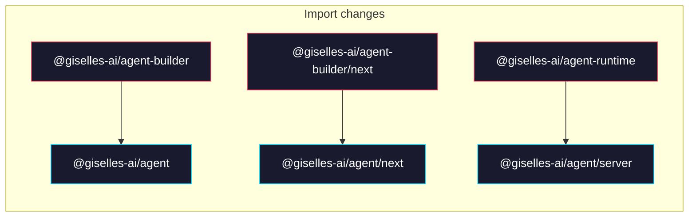

# Phase 3: Update consumer imports

> **GitHub Issue:** #TBD · **Epic:** [AGENTS.md](./AGENTS.md)
> **Dependencies:** Phase 1
> **Parallel with:** Phase 2
> **Blocks:** Phase 4

## Objective

Rewrite import paths and package.json dependencies in `apps/demo`, `apps/minimum-demo`, and `apps/cloud-chat-runner` from the old package names to `@giselles-ai/agent`. Verify each app's typecheck passes.

## What You're Building



## Deliverables

### 1. `apps/demo`

#### `apps/demo/lib/agent.ts`

```diff
-import { defineAgent } from "@giselles-ai/agent-builder";
+import { defineAgent } from "@giselles-ai/agent";
```

#### `apps/demo/next.config.ts`

```diff
-import { withGiselleAgent } from "@giselles-ai/agent-builder/next";
+import { withGiselleAgent } from "@giselles-ai/agent/next";
```

#### `apps/demo/package.json`

In the dependencies section:

```diff
-"@giselles-ai/agent-builder": "workspace:*",
+"@giselles-ai/agent": "workspace:*",
```

### 2. `apps/minimum-demo`

#### `apps/minimum-demo/lib/agent.ts`

```diff
-import { defineAgent } from "@giselles-ai/agent-builder";
+import { defineAgent } from "@giselles-ai/agent";
```

#### `apps/minimum-demo/next.config.ts`

```diff
-import { withGiselleAgent } from "@giselles-ai/agent-builder/next";
+import { withGiselleAgent } from "@giselles-ai/agent/next";
```

#### `apps/minimum-demo/package.json`

In the dependencies section:

```diff
-"@giselles-ai/agent-builder": "workspace:*",
+"@giselles-ai/agent": "workspace:*",
```

### 3. `apps/cloud-chat-runner`

#### `apps/cloud-chat-runner/app/agent-api/[[...path]]/route.ts`

```diff
-import { createAgentApi } from "@giselles-ai/agent-runtime";
+import { createAgentApi } from "@giselles-ai/agent/server";
```

#### `apps/cloud-chat-runner/app/agent-api/_lib/chat-state-store.ts`

```diff
-import type {
-  CloudChatSessionState,
-  CloudChatStateStore,
-} from "@giselles-ai/agent-runtime";
+import type {
+  CloudChatSessionState,
+  CloudChatStateStore,
+} from "@giselles-ai/agent/server";
```

#### `apps/cloud-chat-runner/package.json`

In the dependencies section:

```diff
-"@giselles-ai/agent-runtime": "workspace:*",
+"@giselles-ai/agent": "workspace:*",
```

### 4. Stale reference check

Search for any remaining references to the old package names:

```bash
rg -l "@giselles-ai/agent-builder" apps/
rg -l "@giselles-ai/agent-runtime" apps/
```

Ignore hits in `package-lock`, `.next/` cache, or `node_modules/`. Fix any remaining references in source files.

## Verification

```bash
pnpm install
cd apps/demo && npx tsc --noEmit
cd apps/minimum-demo && npx tsc --noEmit
cd apps/cloud-chat-runner && rm -rf .next/dev/types && npx tsc --noEmit
```

All typechecks must pass with no errors.

## Files to Create/Modify

| File | Action |
|---|---|
| `apps/demo/lib/agent.ts` | **Modify** (import path) |
| `apps/demo/next.config.ts` | **Modify** (import path) |
| `apps/demo/package.json` | **Modify** (dependency) |
| `apps/minimum-demo/lib/agent.ts` | **Modify** (import path) |
| `apps/minimum-demo/next.config.ts` | **Modify** (import path) |
| `apps/minimum-demo/package.json` | **Modify** (dependency) |
| `apps/cloud-chat-runner/app/agent-api/[[...path]]/route.ts` | **Modify** (import path) |
| `apps/cloud-chat-runner/app/agent-api/_lib/chat-state-store.ts` | **Modify** (import path) |
| `apps/cloud-chat-runner/package.json` | **Modify** (dependency) |

## Done Criteria

- [ ] No `@giselles-ai/agent-builder` or `@giselles-ai/agent-runtime` imports remain in `apps/` source files
- [ ] Each app's package.json lists `@giselles-ai/agent` as a dependency
- [ ] `pnpm install` succeeds
- [ ] `tsc --noEmit` passes for all 3 apps
- [ ] Update the status in [AGENTS.md](./AGENTS.md) to `✅ DONE`
