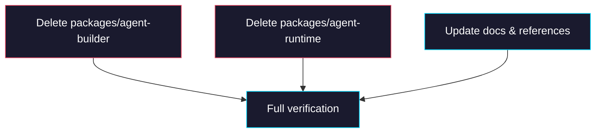

# Phase 4: Delete old packages & verify

> **GitHub Issue:** #TBD · **Epic:** [AGENTS.md](./AGENTS.md)
> **Dependencies:** Phase 2, Phase 3
> **Parallel with:** —
> **Blocks:** —

## Objective

Delete `packages/agent-builder` and `packages/agent-runtime`, then run a full verification pass across the entire monorepo: build, typecheck, test, and stale reference sweep.

## What You're Building



## Deliverables

### 1. Delete `packages/agent-builder`

```bash
rm -rf packages/agent-builder
```

### 2. Delete `packages/agent-runtime`

```bash
rm -rf packages/agent-runtime
```

### 3. Reinstall dependencies

```bash
pnpm install
```

Confirm the lockfile no longer references the old packages.

### 4. Stale reference sweep

Search the entire monorepo for leftover references to the old package names:

```bash
rg "agent-builder" --type ts --type json -l
rg "agent-runtime" --type ts --type json -l
```

The following hits can be ignored:
- `pnpm-lock.yaml`
- `node_modules/`
- `tasks/` (historical task documentation)
- `.turbo/` cache
- `.next/` cache

Fix any remaining references found in source files or package.json.

### 5. Update documentation

#### `README.md`

If the package structure section mentions `agent-builder` / `agent-runtime`, update it to reference `@giselles-ai/agent`.

#### `docs/package-taxonomy.md`

If a taxonomy table exists, merge the `agent-builder` (Integration package) and `agent-runtime` (Domain package) entries into a single `agent` (Domain package) entry.

### 6. Update `tasks/package-structure-realignment/AGENTS.md`

The Architecture Overview diagram and Package Taxonomy Rules table in that file reference `agent-builder` / `agent-runtime`. Add a note marking it as a completed epic, or update the references to `@giselles-ai/agent`.

## Verification

All commands must complete without errors:

```bash
# 1. Dependency resolution
pnpm install

# 2. Full monorepo build
pnpm turbo run build

# 3. New package typecheck
cd packages/agent && npx tsc --noEmit

# 4. New package tests
cd packages/agent && pnpm exec vitest run

# 5. App typechecks
cd apps/demo && npx tsc --noEmit
cd apps/minimum-demo && npx tsc --noEmit
cd apps/cloud-chat-runner && rm -rf .next/dev/types && npx tsc --noEmit

# 6. Stale reference check
rg "agent-builder" --type ts --type json -l | grep -v node_modules | grep -v .turbo | grep -v tasks/ | grep -v pnpm-lock
rg "agent-runtime" --type ts --type json -l | grep -v node_modules | grep -v .turbo | grep -v tasks/ | grep -v pnpm-lock
```

The stale reference check must return empty results.

## Files to Create/Modify

| File | Action |
|---|---|
| `packages/agent-builder/` | **Delete** (entire directory) |
| `packages/agent-runtime/` | **Delete** (entire directory) |
| `README.md` | **Modify** (update package structure) |
| `docs/package-taxonomy.md` | **Modify** (update taxonomy table, if it exists) |

## Done Criteria

- [ ] `packages/agent-builder/` does not exist
- [ ] `packages/agent-runtime/` does not exist
- [ ] `pnpm install` succeeds
- [ ] `pnpm turbo run build` succeeds for all packages
- [ ] `packages/agent` typecheck and tests pass
- [ ] `tsc --noEmit` passes for all 3 apps
- [ ] No stale references to old package names in source files or package.json
- [ ] README / docs are updated
- [ ] Update the status in [AGENTS.md](./AGENTS.md) to `✅ DONE`
